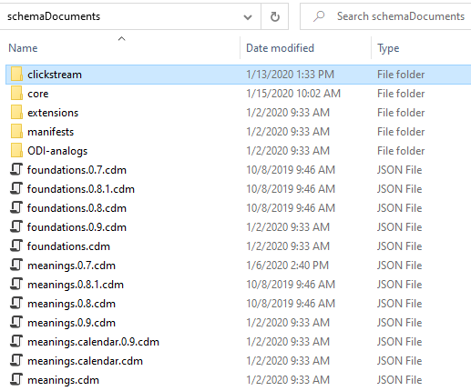
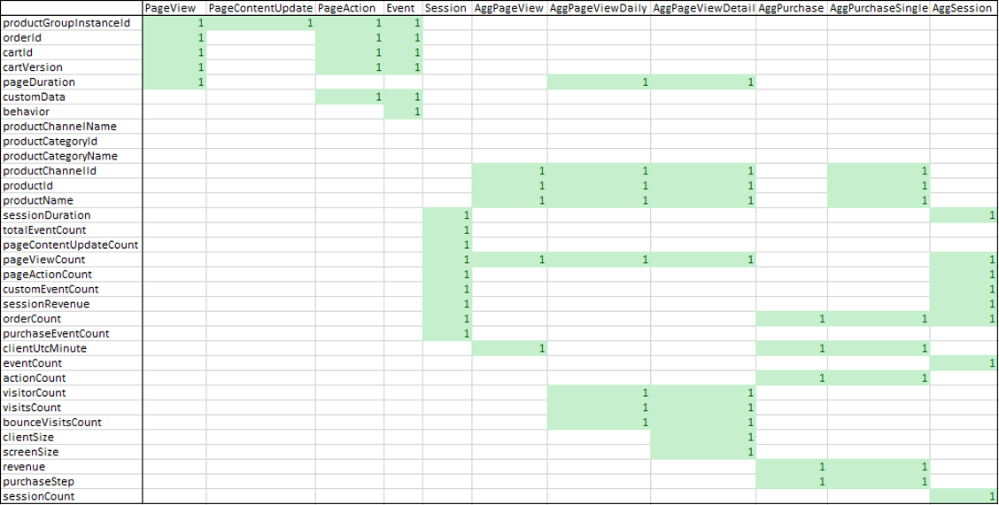
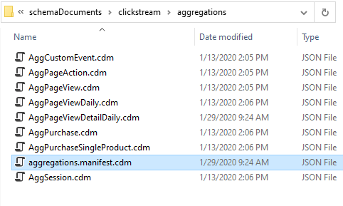
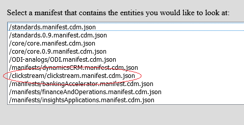
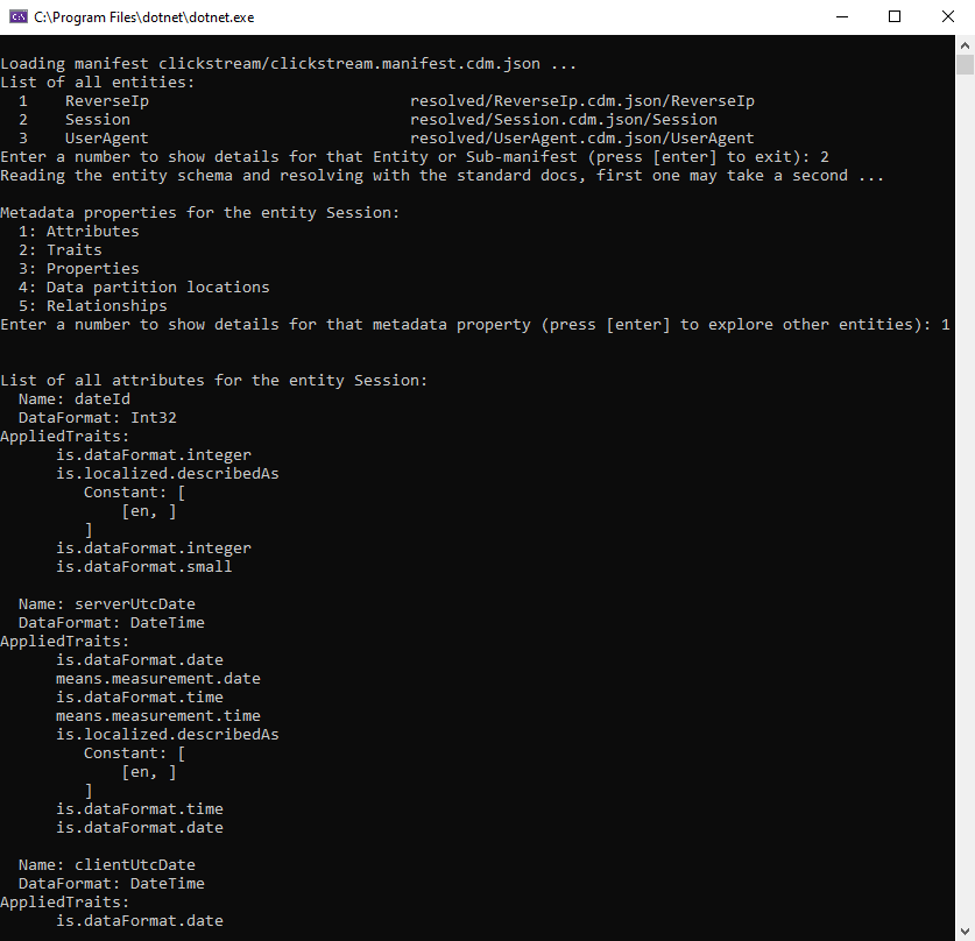

# Create schema documents for the Common Data Model

You have some data and want to start using the Common Data Model. To do so, you'll need to create Common Data Model schema documents. As part of these schema documents, you'll need to create the following:

Document | Description | 
------|--------
Entity schemas | Either logical representations of your existing physical entities or purely logical entity definitions.
Manifest | A collection of all your schema documents that acts as the *entry point* to your Common Data Model entities.

<br/>In this article, you'll create entity schemas for physical and logical entities. What's the difference between the two? 

Entity type | Description
-----|---------
Physical | The entities that exist in your data, often as tables in a database. <br>This means that the entity schemas that you'll create for your physical entities will represent your data in the Common Data Model format. For instance, the attributes described in a Common Data Model entity schema are derived from the fields (or columns) of the corresponding physical entity.
Logical | Purely logical entities, on the other hand, aren't trying to describe an existing physical entity. Instead, they're used to encapsulate commonly used attributes (fields that appear across your physical entities) into meaningful groups. Logical entities allow us to define common attributes once and reuse these definitions, rather than re-defining the same attribute every time it's used in an entity definition. <br>The entity schemas for logical entities represent the logical entity definitions in the Common Data Model format, rather than actual data. 

You'll also create the manifest document and see two different ways to explore schema documents at the end. 

The documents mentioned in this article can be found [here](https://github.com/microsoft/CDM/tree/master/docs/guides/creating-schema-documents).

## Gather entity definitions

To get started, you'll need the entity definitions for your physical entities and your logical entities, if you have any. You'll convert these definitions into entity schemas.

Here's an entity definition sample for the **Session** physical entity: 


When you create the entity schema for **Session**, you'll be creating a logical representation of this physical entity. You'll describe all the fields in **Session** using entity attributes in the schema. 

Notice that **Session** has fields, such as *uaBrowserName* and *uaBrowserVersion*, that have a link to a logical entity (for example, **UserAgent**). These fields appear in many of the entity definitions. To avoid defining these fields as entity attributes repeatedly, they've been grouped into two logical entities, **UserAgent** and **ReverseIp**. This way, **Session** just takes fields from **UserAgent** and **ReverseIp**. Other entities that have fields like *uaBrowserName* and *ripContinent* can do the same. 

>[!TIP]
>Since **UserAgent** and **ReverseIp** are logical entities, they don't exist in the actual data, meaning that there is no physical entity in the data called *UserAgent*.

<br>The logical entity, **UserAgent**, is defined this way:


<br>In this other example, the entity definition for the physical entity, **AggPageViewDetailDaily**, also uses some fields from **UserAgent**, **ReverseIp**, and **Page**: 


>[!NOTE]
>There are more physical and logical entity definitions than what's mentioned above that will be used throughout this guide.

Now that the entity definitions have been laid out, let's dive into creating the actual schema documents. 

## Create the entity schemas

<!-- is the intent of this section to show how to create entity schemas? If yes, I don't think it does-->

For the purpose of this example, all schema documents will be created under the *[schemaDocuments](https://github.com/microsoft/CDM/tree/master/schemaDocuments)* folder, in a sub-folder called *clickstream*:



You'll be using some of the fundamental Common Data Model documents in this root folder, including *foundations.cdm.json* and *schema.cdm.json*, by importing them to your schema documents. 

>[!NOTE]
>All Common Data Model schema documents (including the ones you'll write) end with the *.cdm.json* extension.

### Create entity schemas for logical entities

You'll start by creating an entity schema for the *logical* entity, **UserAgent**. First, create a file called *UserAgent.cdm.json* under the *clickstream* folder with the following content:

```json
{
	"$schema": "../schema.cdm.json",
	"jsonSchemaSemanticVersion": "1.0.0.0",
	"imports": [{
		"corpusPath": "/foundations.cdm.json"
	}],
	"definitions": []
}
```

* **$schema** points to the *schema.cdm.json* file in the root *schemaDocuments folder*. If you're using Visual Studio Code, doing this enables IntelliSense which is helpful when writing schema documents by manually. 
* **jsonSchemaSemanticVersion** identifies the version of the Common Data Model object model that supports this file shape. You are using version 1.0.0.
* **imports** imports other schema documents that are needed for the current document. Here, you've imported the *foundations.cdm.json* file, which itself imports *primitives.cdm.json* (containing fundamental data types, traits, and entities) and *meanings.cdm.json* (containing trait definitions and other convenient data types). Importing this *foundations.cdm.json* document is enough to create the schema documents.

   >[!IMPORTANT]
   >The **corpusPath** is an absolute path to the document. 

* **definitions** contains a list of the current document’s Common Data Model object definitions. This is where you describe the entity. 

<br/>Add an object under **definitions** to define the **UserAgent** logical entity:

```json
"definitions": [{
	"entityName": "UserAgent",
	"extendsEntity": "CdmEntity",
	"description": "The user agent.",
	"hasAttributes": []
}]
```

* **entityName** is the name of the current entity.
* **extendsEntity** denotes the entity from which the current entity extends. Here, it extends from *CdmEntity*, which is the base Common Data Model entity. If you had a different entity that you wanted **UserAgent** to extend from, you would put that entity name instead. 
* **description** describes the current entity.
* **hasAttributes** contains the list of all the attributes that this entity has. This is where you'll be defining the fields from the entity definitions as entity attributes. 

<br/>Going back to the entity definition for **UserAgent**, you can see that there are seven fields:


<br/>The first attribute you'll create is *uaBrowserName*, which is a string type. An attribute object can be defined as follows, under **hasAttributes**:

``` json
"hasAttributes": [{
	"name": "browserName",
	"dataType": "string",
	"description": "Browser name.",
}]
```

Notice the use of the name *browserName*, rather than *uaBrowserName*. You'll learn why this was done in the [Attribute resolution guidance](creating-schemas.md#attribute-resolution-guidance) section.

The data type for this attribute is a string. Alternatively, you could have used the *name* data type, which describes a string that also has the trait "means.identity.name<no-link>". Traits are useful because they help express further semantic meaning. Using the *name* data type shows that this attribute is a name of some kind, which is more meaningful than just knowing that it's a string.

>[!TIP]
>The complete list of all the data types is listed in *primitives.cdm.json* and the various *meanings.cdm.json* files (for example, *meanings.identity.cdm.json*).

<br/>You'll then create *uaBrowserVersion*, which is also a string type: 

``` json
"hasAttributes": [{
		"name": "browserName",
		"dataType": "string",
		"description": "Browser name.",
	},
	{
		"name": "browserName",
		"dataType": "string",
		"appliedTraits": [
			"means.measurement.version"
		],
		"description": "Browser version."
	}
]
```

Here, the trait “means.measurement.version” was applied to this attribute, which shows that *uaBrowserVersion* measures a version of some kind. Again, having traits provides more insight to what an attribute is than just describing *uaBrowserVersion* as a string. 

>[!TIP]
>The list of all the traits that are available is listed in the various *meanings.cdm.json* files. For instance, the trait "means.measurement.version" is defined under the *meanings.measurement.cdm.json* document. 

<br/>After creating attribute objects for each of the fields in the **UserAgent** entity definition, you have this entity schema:

``` json
{
	"$schema": "../schema.cdm.json",
	"jsonSchemaSemanticVersion": "1.0.0",
	"imports": [{
		"corpusPath": "/foundations.cdm.json"
	}],
	"definitions": [{
		"entityName": "UserAgent",
		"extendsEntity": "CdmEntity",
		"description": "The user agent.",
		"hasAttributes": [{
				"name": "browserName",
				"dataType": "string",
				"description": "Browser name."
			},
			{
				"name": "browserVersion",
				"dataType": "string",
				"appliedTraits": [
					"means.measurement.version"
				],
				"description": "Browser version."
			},
			{
				"name": "osName",
				"dataType": "string",
				"description": "Operating system name."
			},
			{
				"name": "osVersion",
				"dataType": "string",
				"appliedTraits": [
					"means.measurement.version"
				],
				"description": "Operating system version."
			},
			{
				"name": "manufacturer",
				"dataType": "string",
				"description": "Device manufacturer."
			},
			{
				"name": "device",
				"dataType": "string",
				"description": "Device."
			},
			{
				"name": "platform",
				"dataType": "string",
				"description": "Platform."
			}
		]
	}]
}
```

<br/>Here's another example entity definition for the other logical entity, **ReverseIp**:


<br/>And here's the entity schema, *ReverseIp.cdm.json*:

``` json
{
	"$schema": "../schema.cdm.json",
	"jsonSchemaSemanticVersion": "1.0.0",
	"imports": [{
		"corpusPath": "/foundations.cdm.json"
	}],
	"definitions": [{
		"entityName": "ReverseIp",
		"extendsEntity": "CdmEntity",
		"description": "Reverse IP.",
		"hasAttributes": [{
				"name": "ripContinent",
				"dataType": "continent"
			},
			{
				"name": "ripCountry",
				"dataType": "country"
			},
			{
				"name": "ripRegion",
				"dataType": "region"
			},
			{
				"name": "ripStateProvince",
				"dataType": "stateOrProvince"
			},
			{
				"name": "ripCity",
				"dataType": "city"
			},
			{
				"name": "isBot",
				"dataType": "boolean"
			}
		]
	}]
}
```

Notice that data types, such as *country*, that are more specific than just *string* were used. These data types are defined in *meanings.location.cdm.json*. Also notice that, unlike **UserAgent**, the attributes for **ReverseIp** are named exactly as they are in the entity definition. You'll see why this was done in the [Attribute resolution guidance](creating-schemas.md#attribute-resolution-guidance) section. 

### _allImports.cdm.json

Before creating entity schemas for the physical entities, you'll first create an *_allImports.cdm.json* document. This document contains a list of central imports that are needed for the other schema documents. 

Attribute groups, which you'll learn about in the [Attribute groups](creating-schemas.md#attribute-groups) section, can also be defined in this document. Having an *allImports* document means that the schema documents can just import this file to import all the central documents and attribute group definitions, rather than having to import the individual schema documents directly.

For instance, since the physical entities use the attributes defined in the logical entities, you'll need to import the schemas for the logical entities to use in the schemas for the physical entities. You can put all the logical entities’ schemas in the *allImports* document and then have the physical entities’ schemas import this document. 

Here's the *_allImports.cdm.json*, under the *clickstream* folder: 

``` json
{
	"jsonSchemaSemanticVersion": "1.0.0",
	"imports": [{
			"corpusPath": "ReverseIp.cdm.json"
		},
		{
			"corpusPath": "UserAgent.cdm.json"
		}
	]
}
```

### Entity schemas for physical entities

Creating the schemas for the physical entities is similar to how you created the schemas for the logical entities.  

Here's the entity definition for the physical entity, **Session**, again:


**Session** uses attributes from **UserAgent** and **ReverseIp**, so you'll need to import these entity schemas. Since you added **UserAgent** and **ReverseIp** to the *allImports* document, you can import that file instead.

Here's the *Session.cdm.json* document, without any attributes:

``` json
{
	"$schema": "../schema.cdm.json",
	"jsonSchemaSemanticVersion": "1.0.0",
	"imports": [{
		"corpusPath": "_allImports.cdm.json"
	}],
	"definitions": [{
		"entityName": "Session",
		"extendsEntity": "CdmEntity",
		"description": "The session.",
		"hasAttributes": []
	}]
}
```

<br/>To use attributes that are defined in another entity schema (that you've imported), you'll create an entity attribute object (an attribute that points to an entity) under **hasAttributes**:

``` json
"hasAttributes": [{
	"name": "ua",
	"entity": "UserAgent"
}]
```

* **name** is the name of the entity attribute. You'll learn why *ua* was used as the name in the [Attribute resolution guidance](creating-schemas.md#attribute-resolution-guidance) section.
* **entity** is a reference to the entity being used as an attribute.

This entity attribute object takes all attributes defined in **UserAgent**.

### Attribute resolution guidance

Attribute resolution guidance provides pointers on the process of resolving entities and attributes, compressing entity schemas into their physical forms. 

You haven't provided any attribute resolution guidance properties in this entity attribute object, so the default resolution guidance is used. By default, resolution guidance takes all the attributes defined in the referenced entity and apply them to the current entity. Here, **Session** takes all seven attributes defined in **UserAgent**. When attributes come from **UserAgent**, the final resolved attribute names in **Session** are in the format of *[name of entity attribute][name of attribute]*.

Earlier, *browserName* was used rather than *uaBrowserName* when defining the attribute in **UserAgent**. This is because all the attributes in **UserAgent** starts with *ua*. When using default resolution guidance, if you notice a common prefix, you can use that as the name of the entity attribute. Since you used *ua* as the name of the entity attribute in **Session**, the attribute *browserName* from **UserAgent** becomes:

    ua + browserName = uaBrowserName

>[!NOTE]
>The first letter of the original attribute name becomes capitalized during this process, for example, **browserName** becomes **BrowserName**.

This is done to all attributes taken from **UserAgent**, so in **Session** you'll have:

    uaBrowserName
	uaBrowserVersion
	…
	uaPlatform

<br/>This becomes particularly useful when you want to use the same entity attributes from the same entity, but with slightly different attribute names:


Here, attributes from **UserAgent** are used twice, but the prefix differs slightly (*machine1UserAgent* vs. *machine2UserAgent*). Since the attributes in **UserAgent** are defined without a prefix, you can do the following to generate resolved attribute names that match the entity definition above:

``` json
"hasAttributes": [{
		"name": "machine1UserAgent",
		"entity": "UserAgent"
	},
	{
		"name": "machine2UserAgent",
		"entity": "UserAgent"
	}
]
```

Since **UserAgent** is a *logical* entity, the attribute names in the entity schema don't have to match exactly with the field names in its original entity definition. What matters is that the attribute names for the physical entities match their entity definitions (and the data). 

<br/>You can't do this when there's no common prefix in the attribute names. For instance, almost all the attributes taken from **ReverseIp** have the common prefix *rip*, but since the attribute *isBot* doesn't have it, you can't use this. Instead, the attributes in **ReverseIp** are named as they appear in the entity definition document, *ReverseIp.cdm.json*:

``` json
{
	"$schema": "../schema.cdm.json",
	"jsonSchemaSemanticVersion": "1.0.0",
	"imports": [{
		"corpusPath": "/foundations.cdm.json"
	}],
	"definitions": [{
		"entityName": "ReverseIp",
		"extendsEntity": "CdmEntity",
		"description": "Reverse IP.",
		"hasAttributes": [{
				"name": "ripContinent",
				"dataType": "continent"
			},
			{
				"name": "ripCountry",
				"dataType": "country"
			},
			{
				"name": "ripRegion",
				"dataType": "region"
			},
			{
				"name": "ripStateProvince",
				"dataType": "stateOrProvince"
			},
			{
				"name": "ripCity",
				"dataType": "city"
			},
			{
				"name": "isBot",
				"dataType": "boolean"
			}
		]
	}]
}
```

<br/>Referring to **Session** from earlier in this article, since you want to use attributes in **ReverseIp**, you'll create another entity attribute object, like you did for the attributes in **UserAgent**:

``` json
"hasAttributes": [{
		"name": "ua",
		"entity": "UserAgent"
	},
	{
		"name": "reverseIp",
		"entity": "ReverseIp",
		"resolutionGuidance": {
			"renameFormat": "{m}"
		}
	}
]
```

Notice that this time a resolution guidance is specified with a *renameFormat* property. This property is a format specifier for the final resolved attribute names. Here, you use *renameFormat*: *{m}* to specify that you want to use the attribute names exactly as they're named in the referenced entity. This means that in **Session**, the attributes that are taken from **ReverseIp** will look like:

	ripContinent
	ripCountry
	…
	isBot

If you didn't specify a resolution guidance here, then the final attribute names in **Session** would have had the default format of *[name of entity attribute ][name of attribute]*, for example, *reverseIpContinent*.  

<br/>What if you only want to take a few attributes from an entity, rather than all the attributes? You can specify which attributes you want by using the *selectsSubAttribute* property in resolution guidance:

```` json
"hasAttributes": [{
	"name": "ua",
	"entity": "UserAgent",
	"resolutionGuidance": {
		"selectSubAttribute": {
			"selects": "some",
			"selectsSomeTakeNames": [
				"uaBrowserName",
				"uaBrowserVersion"
			]
		}
	}
}]
````

*selectsSomeTakeNames* is a list of attributes from the referenced entity that should be added to your entity. There's also *selectsSomeAvoidNames*, which is a list of attributes that shouldn't be added. Here, you only want to take *uaBrowserName* and *uaBrowserVersion* as attributes from **UserAgent**. Notice that the expected resolved attribute names were used to populate this list. 

If you had a *renameFormat* as well, you would use the attribute names after the rename format specifier has been applied: 

```` json
"hasAttributes": [{
	"name": "ua",
	"entity": "UserAgent",
	"resolutionGuidance": {
		"renameFormat": "{m}",
		"selectSubAttribute": {
			"selects": "some",
			"selectsSomeTakeNames": [
				"browserName",
				"browserVersion"
			]
		}
	}
}]
````

### Attribute groups

Here's the entity definition for **Session**:


While you *could* define all the fields listed in gray (such as *dateId*, *environmentId*, *sessionRevenue*, etc.) as attributes in **Session**, many of these fields are also used in other physical entities. It would be useful to define these fields once and just reuse the attribute definitions, like you did with the attributes from the logical entities. 

Instead of grouping these fields into logical entities, you can also use attribute groups. An attribute group is a group of attributes that provides a similar role. If you notice a grouping of attributes that always appears together across your physical entities, you can put them in an attribute group. You can have attribute groups that only contain a single attribute as well, if that attribute is used often in your entities but doesn't have other attributes it always appears with. It should make sense why the attributes in an attribute group are grouped together, rather than the grouping just being a mere coincidence. 

A helpful way to determine attribute groups is to lay out all the fields used in your entity definitions in a table with the entities on one axis and fields on the other:



From this table, you can see that there are several groups of attributes that always appear together. A few notable attributes are highlighted in red.


For instance, the attributes *orderId*, *cartId*, and *cartVersion* always appear together in **PageView**, **PageAction**, and **Event**. These can be put into an attribute group.

On the other hand, *pageViewCount* is used in **Session**, **AggPageView**, **AggPageViewDaily**, **AggPageViewDetailDaily**, and **AggSession** but doesn't have other attributes with which it always appears. In this case, you can create an attribute group containing *pageViewCount* only. 

Lastly, you see that *sessionCount* is only used in **AggSession**. In this case, you'll not create an attribute group and just define *sessionCount* as an attribute inside **AggSession**. 

<br/>Back to the original example. After identifying attribute groups, define them inside your *allImports* document, since the attribute groups are used in several schemas for the physical entities. 

Here's the *_allImports.cdm.json* with two attribute group objects under **definitions**: 

``` json
{
	"jsonSchemaSemanticVersion": "1.0.0",
	"imports": [{
			"corpusPath": "ReverseIp.cdm.json"
		},
		{
			"corpusPath": "UserAgent.cdm.json"
		}
	],
	"definitions": [{
			"attributeGroupName": "dateId",
			"members": [{
				"name": "dateId",
				"dataType": "integer"
			}]
		},
		{
			"attributeGroupName": "sessionUserInfo",
			"members": [{
					"name": "userId",
					"dataType": "string"
				},
				{
					"name": "anonymousUserId",
					"dataType": "string"
				},
				{
					"name": "ipAddress",
					"dataType": "string"
				},
				{
					"name": "sessionId",
					"dataType": "string"
				}
			]
		}
	]
}
```

* **attributeGroupName** is the name of the attribute group.
* **members** is a list of attribute definitions for the attribute group.

Now that you have the attribute groups defined in your *allImports* document, you can use them in **Session** by creating an attribute group reference object under **hasAttributes**:

``` json
"hasAttributes": [{
		"name": "ua",
		"entity": "UserAgent"
	},
	{
		"name": "reverseIp",
		"entity": "ReverseIp",
		"resolutionGuidance": {
			"renameFormat": "{m}"
		}
	},
	{
		"attributeGroupReference": "dateId"
	}
]
```

* **attributeGroupReference** points to the name of the attribute group that you want to use. 

You can also define attributes that are only used in **Session** directly in its entity schema:

``` json
"hasAttributes": [{
		"name": "ua",
		"entity": "UserAgent"
	},
	{
		"name": "reverseIp",
		"entity": "ReverseIp",
		"resolutionGuidance": {
			"renameFormat": "{m}"
		}
	},
	{
		"attributeGroupReference": "dateId"
	},
	{
		"name": "totalEventCount",
		"dataType": "integer",
		"appliedTraits": [
			"means.measurement.count"
		]
	}
]
```

The final entity schema for **Session** looks like this:

>[!NOTE]
>The order of the attribute objects shifted so that this entity schema matches the order of the fields in the actual data.

``` json
{
	"$schema": "../schema.cdm.json",
	"jsonSchemaSemanticVersion": "1.0.0",
	"imports": [{
		"corpusPath": "_allImports.cdm.json"
	}],
	"definitions": [{
		"entityName": "Session",
		"extendsEntity": "CdmEntity",
		"description": "The session.",
		"hasAttributes": [{
				"attributeGroupReference": "dateId"
			},
			{
				"attributeGroupReference": "serverUtcDate"
			},
			{
				"attributeGroupReference": "clientUtcDate"
			},
			{
				"attributeGroupReference": "environmentId"
			},
			{
				"attributeGroupReference": "sessionUserInfo"
			},
			{
				"attributeGroupReference": "userSessionAuthInfo"
			},
			{
				"attributeGroupReference": "browserSettings"
			},
			{
				"attributeGroupReference": "sessionDuration"
			},
			{
				"name": "totalEventCount",
				"dataType": "integer",
				"appliedTraits": [
					"means.measurement.count"
				]
			},
			{
				"attributeGroupReference": "pageViewCount"
			},
			{
				"name": "pageContentUpdateCount",
				"dataType": "integer",
				"appliedTraits": [
					"means.measurement.count"
				]
			},
			{
				"attributeGroupReference": "pageActionCount"
			},
			{
				"name": "purchaseEventCount",
				"dataType": "integer",
				"appliedTraits": [
					"means.measurement.count"
				]
			},
			{
				"attributeGroupReference": "customEventCount"
			},
			{
				"attributeGroupReference": "orderCount"
			},
			{
				"attributeGroupReference": "sessionRevenue"
			},
			{
				"name": "ua",
				"entity": "UserAgent"
			},
			{
				"name": "reverseIp",
				"entity": "ReverseIp",
				"resolutionGuidance": {
					"renameFormat": "{m}"
				}
			}
		]
	}]
}
```

## Create the manifest

Now that you're done with your entity schemas, you're going to create the manifest document. The manifest references your entity schemas and acts as the entry point to your entities. Note that the manifest file should end with the *.manifest.cdm.json* extension.

Here's the *clickstream.manifest.cdm.json*, under the *clickstream* folder:

``` json
{
	"$schema": "CdmManifest.cdm.json",
	"jsonSchemaSemanticVersion": "1.0.0",
	"imports": [],
	"manifestName": "clickstream",
	"explanation": "CDM standard entities",
	"entities": [{
			"type": "LocalEntity",
			"entityName": "ReverseIp",
			"entityPath": "ReverseIp.cdm.json/ReverseIp"
		},
		{
			"type": "LocalEntity",
			"entityName": "Session",
			"entityPath": "Session.cdm.json/Session"
		},
		{
			"type": "LocalEntity",
			"entityName": "UserAgent",
			"entityPath": "UserAgent.cdm.json/UserAgent"
		}
	]
}
```

Most of the properties in the previous code block are fairly self-explanatory. Take a look at **entities**, which is a list of entity declaration objects. This is where you reference all your entity schemas (**ReverseIp**, **Session**, and **UserAgent**).

* **type** refers to the type of the entity declaration (local or referenced). Since your entity declarations reside locally, *LocalEntity* is used as the type. 
* **entityName** is the name of the entity.
* **entityPath** is the corpus path to the entity definition in the entity schema. It's in the format of *[name of entity schema]/[name of entity]*. 

The manifest can reference sub-manifests as well. For example, if you had a sub-folder under *clickstream* called aggregations (that contained entity schemas relating to aggregated data), you could create an *aggregrations.manifest.cdm.json* document in that folder: 



You would then add the manifest declaration for *aggregrations.manifest.cdm.json* in *clickstream.manifest.cdm.json* under **subManifests**:

``` json
{
	"$schema": "CdmManifest.cdm.json",
	"jsonSchemaSemanticVersion": "1.0.0",
	"imports": [],
	"manifestName": "clickstream",
	"explanation": "CDM standard entities",
	"entities": [{
			"type": "LocalEntity",
			"entityName": "ReverseIp",
			"entityPath": "ReverseIp.cdm.json/ReverseIp"
		},
		{
			"type": "LocalEntity",
			"entityName": "Session",
			"entityPath": "Session.cdm.json/Session"
		},
		{
			"type": "LocalEntity",
			"entityName": "UserAgent",
			"entityPath": "UserAgent.cdm.json/UserAgent"
		}
	],
	"subManifests": [{
		"manifestName": "aggregations",
		"definition": "aggregations/aggregations.manifest.cdm.json"
	}]
}
```

Doing this maintains the original folder structure in your schema documents. 

## Explore the entities

To wrap up, you can explore your created Common Data Model schema documents. Let's go over the two different tools you can use.

### Entity navigator

You can use the [Entity navigator](https://microsoft.github.io/CDM/) to view your created schema documents. 

You'll need to load your manifest to explore your entities. First, select *Load from files…*, upload the root *schemaDocuments* folder, and then select *clickstream/clickstream.manifest.cdm.json* as the manifest:




The navigator displays the following after loading the manifest:


You can see all three entities for which you created schemas under *clickstream*. You can also see all the entities that are referenced by the sub-manifest *aggregations.manifest.cdm.json*, under “aggregations”. Notice that the original folder structure of all these files is maintained. 

Lastly, select the **Session** entity and compare the resolved entity to the original entity definition:


### Read the manifest sample

You can also use the code sample, [1-read-manifest](https://github.com/microsoft/CDM/tree/master/samples/1-read-manifest), to explore your entities. This sample reads a manifest document and lists all the entities referenced therein. You can then select an entity to list all its attributes, traits, properties, data partition file locations, and relationships. 

The sample originally points to a manifest called *default.manifest.cdm.json* under the *1-read-manifest* folder:

``` C#
// ------------------------------------------------------------------------------------------------------------
// Instantiate a corpus. The corpus is the collection of all documents and folders created or discovered 
// while navigating objects and paths.

var cdmCorpus = new CdmCorpusDefinition();

// ------------------------------------------------------------------------------------------------------------
// Configure storage adapters and mount them to the corpus. 

// We want our storage adapters to point at the local manifest location and at the example public standards.
string pathFromExeToExampleRoot = "../../../../../../";

// Storage adapter pointing to the target local manifest location. 
cdmCorpus.Storage.Mount("local", new LocalAdapter(pathFromExeToExampleRoot + "1-read-manifest"));

// 'local' is our default namespace. 
// Any paths that start navigating without a device tag (ex. 'cdm') will just default to the 'local' namepace.
cdmCorpus.Storage.DefaultNamespace = "local";

// Storage adapter pointing to the example public standards.
// This is a fake 'cdm'; normally the Github adapter would be used to point at the real public standards.
// Mount it as the 'cdm' device, not the default, so that we must use "cdm:<folder-path>" to get there.
cdmCorpus.Storage.Mount("cdm", new LocalAdapter(pathFromExeToExampleRoot + "example-public-standards"));

// Example how to mount to the ADLS:
// cdmCorpus.Storage.Mount("adls",
//    new ADLSAdapter(
//      "<ACCOUNT-NAME>.dfs.core.windows.net", // Hostname.
//      "/<FILESYSTEM-NAME>", // Root.
//      "72f988bf-86f1-41af-91ab-2d7cd011db47",  // Tenant ID.
//      "<CLIENT-ID>",  // Client ID.
//      "<CLIENT-SECRET>" // Client secret.
//    )
// );

// ------------------------------------------------------------------------------------------------------------
// Open the default manifest file at the root.

await ExploreManifest(cdmCorpus, "default.manifest.cdm.json");
```

Edit the sample so that it points to your *clickstream.manifest.cdm.json* document:

``` C#
// ------------------------------------------------------------------------------------------------------------
// Instantiate a corpus. The corpus is the collection of all documents and folders created or discovered 
// while navigating objects and paths.

var cdmCorpus = new CdmCorpusDefinition();

// ------------------------------------------------------------------------------------------------------------
// Configure storage adapters and mount them to the corpus. 

// We want our storage adapters to point at the local manifest location and at the example public standards.
string pathFromExeToExampleRoot = "../../../../../../";

// Storage adapter pointing to the target local manifest location. 
cdmCorpus.Storage.Mount("local", new LocalAdapter(@"C:\path\to\CDM\schemaDocuments"));

// 'local' is our default namespace. 
// Any paths that start navigating without a device tag (ex. 'cdm') will just default to the 'local' namepace.
cdmCorpus.Storage.DefaultNamespace = "local";

// Storage adapter pointing to the example public standards.
// This is a fake 'cdm'; normally the Github adapter would be used to point at the real public standards.
// Mount it as the 'cdm' device, not the default, so that we must use "cdm:<folder-path>" to get there.
cdmCorpus.Storage.Mount("cdm", new LocalAdapter(@"C:\path\to\CDM\schemaDocuments"));

// Example how to mount to the ADLS:
// cdmCorpus.Storage.Mount("adls",
//    new ADLSAdapter(
//      "<ACCOUNT-NAME>.dfs.core.windows.net", // Hostname.
//      "/<FILESYSTEM-NAME>", // Root.
//      "72f988bf-86f1-41af-91ab-2d7cd011db47",  // Tenant ID.
//      "<CLIENT-ID>",  // Client ID.
//      "<CLIENT-SECRET>" // Client secret.
//    )
// );

// ------------------------------------------------------------------------------------------------------------
// Open the default manifest file at the root.

await ExploreManifest(cdmCorpus, "clickstream/clickstream.manifest.cdm.json");
```

This sample works with resolved documents, so you need to resolve your manifest and entities. Do this by adding the following line of code under `ExploreManifest(…)`:

``` C#
static async Task ExploreManifest(CdmCorpusDefinition cdmCorpus, string manifestPath)
{
	Console.WriteLine($"\nLoading manifest {manifestPath} ...");

    CdmManifestDefinition originalManifest = await cdmCorpus.FetchObjectAsync<CdmManifestDefinition>(manifestPath);
    CdmManifestDefinition manifest = await originalManifest.CreateResolvedManifestAsync("resolved", null);

    // ------------------------------------------------------------------------------------------------------------
    // List all the entities found in the manifest and allow the user to choose which entity to explore.
		
```

Now you can run the sample:


You can see that the program has read the manifest and listed all your entities.

Explore the **Session** entity by entering **2**:


You can see that the **Session** entity schema was read.

Lastly, explore the attributes in **Session** by entering **1**:



>[!NOTE]
>There are more attributes listed by the program than what's shown in this image.

