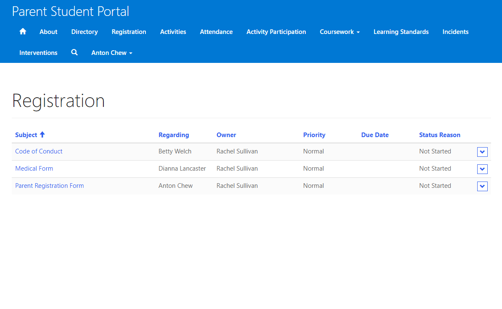
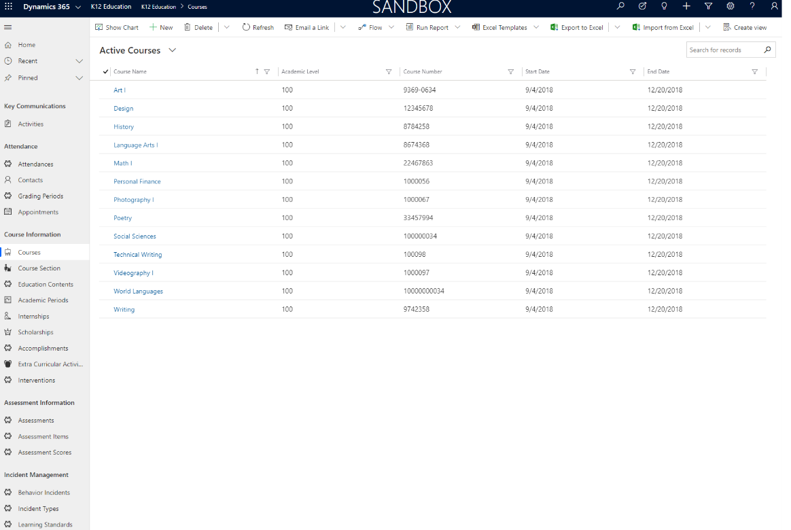
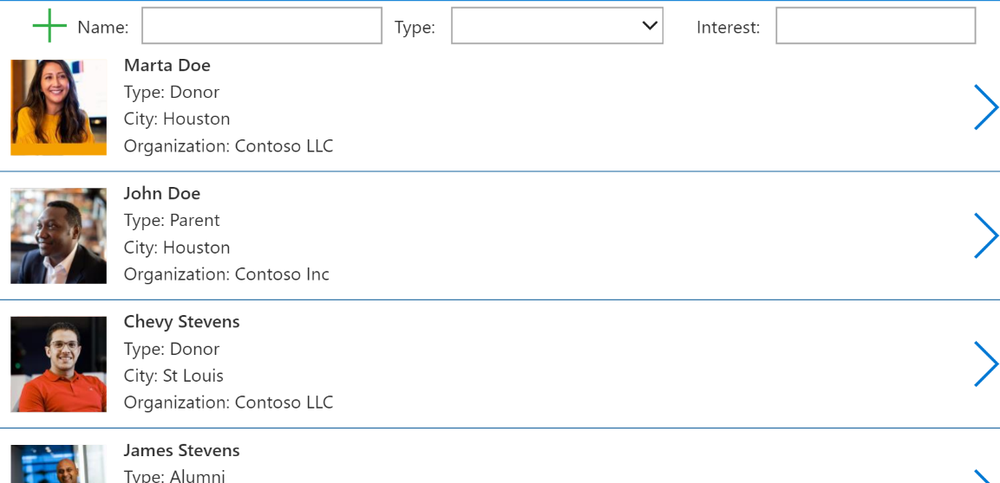

---

title: Dynamics 365 Education K-12 Accelerator Overview (preview)| Microsoft Docs

description:  Dynamics 365 Education Accelerators provide a uniform platform for those who wish to connect, embed, or extend the Dynamics 365 platform and Power Platform.

author: MeenooRami
ms.service: common-data-model
ms.reviewer: v-dehaas
ms.topic: article
ms.date: 05/01/2020
ms.author: merami

---

# K-12

[!INCLUDE [cc-beta-prerelease-disclaimer](../includes/cc-beta-prerelease-disclaimer.md)]

## What’s new?

The K12 scenario is released to sit on top of an existing Dynamics 365 instance or Power Platform instance to assist with day to day operations or as a stand-alone data model for developers. The holistic student profile and educator and community engagement scenario contains the data model, installable scenarios (including standard entity attribute extensions, K12 specific education entities, pre-built dashboard and portals, sample data) and other tools to help customers and partners build and deploy new solutions.

The accelerator includes the following features:

- K12 Student and Parent Portal
- Collect School paperwork and forms
- Ability to engage donors and raise funds
- Student Behavior Management Application
- Track and Report Attendance Application and Dashboard

## Site-map extensions

With the Dynamics 365 K12 scenario, schools can optimize student success through optimal understanding of data about the student journey. When the accelerator is installed into Dynamics 365, the experience is transformed into one specifically built for K12 schools and one that allows schools to quickly build Power Apps and Power BI visualizations.

## Entities and workflows

This accelerator provides these entities to support the needs of K12 schools:

### EDUCATIONCORE

- Contact
- Account
- Test Type
- Test Score
- Course History
- Registration Status
- Course
- Course Section
- Extra Curricular Activity
- Extra Curricular Activity Participants
- Address / Customer Address
- Academic Period
- Program 
- Program Level
- Academic Period Details
- Student Status
- Internship
- Internship Applicants
- Accomplishments
- Area of Interest
- Area of Study
- Student Program Type
- Previous Education
- Education Level
- Scholarship
- Scholarship Applicant

### K-12

- Attendance
- Grading Period
- Incident Type
- Incident Action
- Behavior Incidents
- Intervention
- Intervention Participants
- Education Content
- Assessment
- Assessment Item
- Student Assessment Response
- Learning Standards

## Forms and dashboards

To better understand and use the available forms and dashboards in this scenario, let’s look it through the personas of a parent, an administrator, or an educator.

## Parent and Student Portal

This portal allows both the parent and student access to the student’s information. From attendance to grades it facilitates clear conversations about progress made by students and caregivers/parents who support their students.

> [!div class="mx-imgBorder"]
> 

Here students can see all their assignments and progress made with each, as well as focus on a particular subject to see only those assignments.

> [!div class="mx-imgBorder"]
> 

Students can also easily check grades and test scores.

> [!div class="mx-imgBorder"]
> 

As well as other important details like attendance.

> [!div class="mx-imgBorder"]
> 

And explore extracurricular activities offered at their schools.

> [!div class="mx-imgBorder"]
> 

Parents can also easily update their family information for the school, include important medical forms and more.

> [!div class="mx-imgBorder"]
> 

## Model-driven app

Administrators can have a complete view of attendance, courses, internships, accomplishments, extra-curricular activities, interventions, assessments, and behavior incidents. The Administrator sees this single view to access information for their students and take informed actions to support students.

> [!div class="mx-imgBorder"]
> 

## Donor management app

Administrators can use the donor app to view and manage donors and update them how their donations are being utilized by the school.

> [!div class="mx-imgBorder"]
> 

The Administrators can also easily get a clear view of donation designations.> 

## Student behavior app

Administrators can easily record, track, and encourage positive behavior from students.

> [!div class="mx-imgBorder"]
> 

They can also better understand details on how students earned recognition for positive behaviors in class. 

> [!div class="mx-imgBorder"]
> 

## Student attendance app

Educators can easily track and reports attendance in the Attendance application. This application can also be modified to use on a table or phone to increase ease of using it.

> [!div class="mx-imgBorder"]
> 

## Attendance Power BI template

Attendance Power BI report dashboard allows Educators to easily view the attendance data and take action on it.

> [!div class="mx-imgBorder"]
> 

## Additional resources -K12

Education Accelerator data model, solutions, data samples, Power BI examples, SDK extensions, and more are provided as part of the open-source creative license and available on [Github](https://aka.ms/edugithub).

## Connect and share feedback
Do you have feedback or need support? Connect with us at dynindaccsupport@microsoft.com.