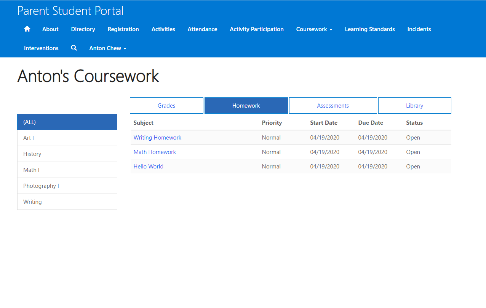
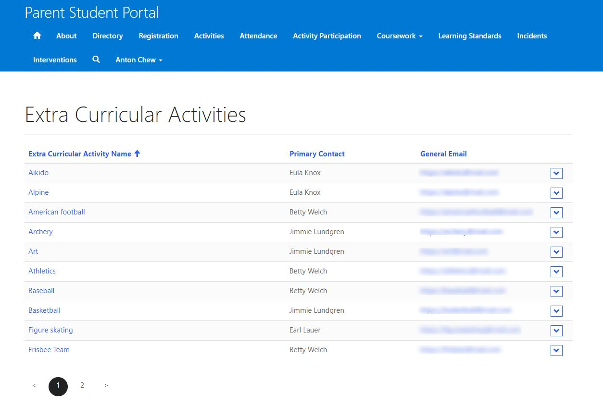

---

title: Dynamics 365 education accelerator K-12   | Microsoft Docs
description:  The Dynamics 365 education accelerator K-12 component (preview) provides a uniform platform for those who wish to connect, embed, or extend the Dynamics 365 platform and Microsoft Power Platform.
author: MeenooRami
ms.service: common-data-model
ms.reviewer: v-dehaas
ms.topic: article
ms.date: 07/01/2020
ms.author: merami

---

# Dynamics 365 education accelerator – K-12

The K-12 component in the Dynamics 365 education accelerator sits on top of an existing Dynamics 365 instance or Power Apps instance to assist with day-to-day operations or as a standalone data model for developers. The holistic student profile, educator, and community engagement scenario contains:

- The data model
- Installable scenarios, including:
  - Standard entity attribute extensions
  - Specific education entities for K-12
  - Pre-built dashboards and portals
  - Sample data
- Other tools to help customers and partners build and deploy new solutions

The accelerator includes the following features:

- K-12 parent and student portal
- Collect School paperwork and forms
- Ability to engage donors and raise funds
- Student Behavior Management application
- Track and Report Attendance application and dashboard

## Site-map extensions

With the K-12 component, schools can optimize student success through understanding data about the student journey. When the accelerator is installed, the experience is transformed into one specifically built for K-12 schools and one that allows schools to quickly build Power Apps and Power BI visualizations.

## Entities and workflows

This accelerator provides these entities to support the needs of K-12 schools:

### Education core entities

|   |  |                        |
| ------------- | ------------- |----------|
| Account  | Test Type  | Test Score|
| Course History  | Registration Status  | Course |
| Contact |Course Section |Extracurricular Activity |
|Extracurricular Activity Participants |Address / Customer Address |Academic Period |
|Program |Program Level |Academic Period Details |
|Student Status |Internship |Internship Applicants   |
|Accomplishments |Area of Interest |Area of Study |
|Student Program Type |Previous Education |Education Level |
|Scholarship |Scholarship Applicant | |

### K-12 entities

|   |  |                        |
| ------------- | ------------- |----------|
| Attendance  | Grading Period | Incident Type |
| Incident Action | Behavior Incidents  | Intervention |
|Intervention Participants |Education Content |Assessment |
| Assessment Item|Student Assessment Response |Learning Standards | 

## Forms, dashboards, and apps

To better understand and use the available forms, dashboards, and apps in this scenario, let’s look it through the personas of a parent, an administrator, or an educator. 

## Parent and student portal

This portal allows both the parent and student access to the student’s information. From attendance to grades it facilitates clear conversations about progress made by students and caregivers/parents who support their students.

> [!div class="mx-imgBorder"]
> 

Here students can see all their assignments and progress made with each, as well as focus on a particular subject to see only those assignments.

> [!div class="mx-imgBorder"]
> 

Students can easily check grades and test scores.

<!--note from editor: Anton's name is misspelled in the last 2 rows of this image. -->

> [!div class="mx-imgBorder"]
> 

They can also check other important details like attendance.

> [!div class="mx-imgBorder"]
> 

They can explore extracurricular activities offered at their schools.

> [!div class="mx-imgBorder"]
> 

Parents can also easily update their family information for the school, including important medical forms.

> [!div class="mx-imgBorder"]
> 

## Model-driven app

Administrators have a complete view of attendance, courses, internships, accomplishments, extracurricular activities, interventions, assessments, and behavior incidents. The administrator sees this single view to access information for their students and take informed actions to support students.

> [!div class="mx-imgBorder"]
> 

## Donor management app

Administrators use the donor app to view and manage donors and update them on how the school is using their donations.

> [!div class="mx-imgBorder"]
> 

Administrators can also get a clear view of donation designations.

## Student Behavior Management app

Administrators can easily record, track, and encourage positive behavior from students.

> [!div class="mx-imgBorder"]
> 

They can also better understand details on how students earned recognition for positive behaviors in class.

> [!div class="mx-imgBorder"]
> 

## Track and Report Attendance app 

Educators can easily track and reports attendance in the attendance application. This application can also be modified to use on a table or phone to increase ease of using it.

> [!div class="mx-imgBorder"]
> 

## Attendance Power BI dashboard

The Attendance Power BI report dashboard allows educators to easily view and take action on attendance data.

> [!div class="mx-imgBorder"]
> 

## Additional resources

- Download the Dynamics 365 education accelerator from [AppSource](https://appsource.microsoft.com/en-us/product/dynamics-365/mshied.educationcommondatamodel?tab=Overview)
- Read our K-12 blogpost from [Cloudblogs](https://cloudblogs.microsoft.com/dynamics365/it/2020/06/19/dynamics-365-education-accelerator-update-supports-k-12-application-development/)
- The K-12 data model, solutions, data samples, Power BI examples, SDK extensions, and more are provided as part of the open-source creative license available on [Github](https://aka.ms/edugithub)
- Continue your accelerator experience and engage with experts and peers, read blog articles, and find local events within the industry accelerator community. [Join us](https://community.dynamics.com/365/industry-accelerators)

## Connect and share feedback
Do you have feedback or need support? Contact us at [dynindaccsupport@microsoft.com](mailto:dynindaccsupport@microsoft.com).
