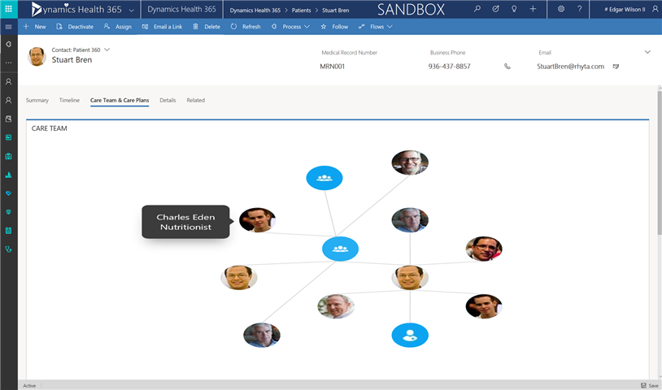

# The Dynamics 365 Healthcare Accelerator

Rapidly develop healthcare solutions using [Fast Healthcare Interoperability Resources (FHIR)](https://www.hl7.org/fhir/overview.html) entities (such as patient, condition, and care plan) in the [Dynamics 365 Healthcare Accelerator](https://appsource.microsoft.com/product/dynamics-365/msemr.healthcarecommondatamodel?tab=Overview).

This accelerator was announced in July 2018 at Ignite, and the initial release includes these features:

- extension of the Common Data Model to include concepts for health, including entity definitions and relationships
- **Patient**, **Practitioner**, **Related person**, and other customer-engagement forms that you can enhance or use out of the box
- a sample app that demonstrates some possibilities of the Unified Interface
- support for building canvas and model-driven apps in Power Apps
- support for extending the model with custom entities, forms, and relationships that meet your business needs
- support for analytics
- a Common Data Service solution that you can install from AppSource

## Site-map extensions

With the Healthcare Accelerator plugged in to the Dynamics 365 platform, you can optimize various aspects of care coordination and segment patients and providers based on EMR data. You can also manage the care continuum of all patients by leveraging the entire customer-engagement solution within Dynamics 365.

This accelerator adds a layer to the rich feature set of the base Dynamics 365 functionality by adding a ribbon to help you manage the special needs of your health organization. This ribbon contains entities to record patient data, appointments, procedures, nutrition orders, care plans, and many other functions.

## Entities and workflows

The Healthcare Accelerator provides these entities in support of the FHIR HL7 (Health Level Seven) specification:

| | | | |
| ------- | -----------------|------------------| ------------|
| Patients | Healthcare Services | Care Plans | Encounters |
|Practitioners | Clinical Impression Problems | Risk Assessments |Specimens|
|Organizations | Allergy Intolerances | Observations |Medications |
|Devices | Medication Administration | Episodes of Care |Locations |
| Healthcare Services | Medication Requests | | |

The accelerator also includes these workflows:

| | | |
| ------- | -----------------|------------------|
|Tasks | Appointments (EMR) | Procedures|
|Nutrition Orders | Referral Requests |

## Forms

The Healthcare Accelerator combines standard CRM entities with customized entities to make it easier to build solutions on top. This section describes examples of built-in forms and views that demonstrate these entities.

### Patient/Practitioner 360

This view shows Electronic Medical Record (EMR) data directly within a patient or practitioner-specific form in Dynamics. The data model shows appointments, procedures, medications, and other patient/practitioner data in context and a user-friendly interface.

### Patient/Provider Timeline

This view provides a sequential look at all activities that have occurred with the patient or provider. The timeline provides the ability to scale, leveraging a slider, and interact with data directly.

### Care Team Viewer

A clear understanding of which member of a patient's care team owns each facet of care is paramount, as this view clearly and and concisely shows.

## Additional resources

- Download the Dynamics 365 Healthcare Accelerator from [AppSource](https://appsource.microsoft.com/product/dynamics-365/msemr.healthcarecommondatamodel?tab=Overview)
- The healthcare data model, solutions, data samples, Power BI examples, SDK extensions, and more are provided as part of the open-source creative license and available on [GitHub](https://github.com/microsoft/Industry-Accelerator-Health).
- [More details](https://community.dynamics.com/365/b/healthaccelerator/archive/2018/07/19/dynamics-365-health-accelerator-solution-first-look) about the Health Accelerator
- [Additional topics](https://community.dynamics.com/365/b/dynamics365isvsuccess/archive/2018/08/01/dynamics-365-brings-industry-focus-through-the-microsoft-power-platform-and-solution-accelerators) about the accelerators
