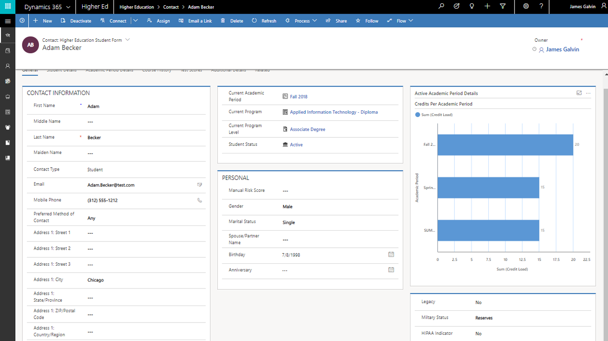

# The Dynamics 365 Higher-Education Accelerator

With the [Dynamics 365 Higher-Education Accelerator](https://appsource.microsoft.com/product/dynamics-365/mshied.highereducationcommondatamodel?tab=Overview), you can develop solutions that are based on entities and attributes that higher-education institutions use. These entities include students, faculty, courses, test scores, and more. The accelerator includes entities, fields, forms, views, and dashboards.

This [accelerator was announced](https://educationblog.microsoft.com/2018/10/transforming-higher-education-to-address-the-skills-gap/) in October 2018 at EDUCAUSE, and the initial release provides:

- extensions to the Common Data Model (CDM) to include concepts for higher education, including entity definitions and relationships
- system views that provide easy access to entities such as students, faculty, extracurricular activities, previous education, test scores, courses, academic periods, programs, test types, registration status, and areas of interest
- student, faculty, course history, and other customer-engagement forms, which you can enhance or use out of the box
- a sample app to show some possibilities of the Unified Interface
- example Dynamics 365 dashboards and a Power BI dashboard that provides analytics for completed courses and allows drilling into details about student performance, instructor effectiveness, and course feedback
- support for building additional canvas and model-driven apps in PowerApps
- a solution that you can deploy and install from AppSource or GitHub

## Site-map extensions

With the Dynamics 365 Higher-Education Accelerator, institutions can optimize student and faculty engagement, improve institutional effectiveness, and predict outcomes and gain insights from analytics. When the accelerator is installed into Dynamics 365, the experience is transformed into one specifically built for higher education and allows institutions to quickly build PowerApps and Power BI visualizations.

Higher-education institutions can build their business processes on top of the entities in the accelerator. The ribbon customizations contain entities to record student, faculty, and alumni interactions, appointments, events, and outreach.

## Entities and workflows

This accelerator provides these entities to support the needs of higher-education institutions:

| | | | |
| ------- | -----------------|------------------| ------------|
|Accounts |Course |Previous Education |Student Program Type|
|Contacts |Course History |Program |Student Status|
|Academic Period |Course Section |Program Level |Test Score|
|Academic Period Detail |Education Level |Program Version |Test Type|
|Area of Interest |Extra Curricular Activity| Program version Detail |Area of Study|
|Extra Curricular Participant |Registration Status |

## Forms and dashboards

The Dynamics 365 Higher-Education Accelerator combines standard Dynamics 365 entities with customized entities to make it easier to build solutions. This section describes some of the forms, views, and dashboards that demonstrate the new entities and the data model.

### Student form

This Dynamics 365 form shows student information (such as contact information, course load, areas of study, degree, course history, test scores) in the context of the app and the interface. The student record becomes the source of truth and engagement to deliver the best support throughout the student lifecycle.

### Course-history form

The course-history form shows the course name, the course section, the instructor, the credit, the grade, and more.

### Institutional dashboard

This accelerator includes a student dashboard in Dynamics 365 and an institutional dashboard in Power BI. With the institutional dashboard, you gain analytics and insights into students, classes, and key metrics such as students by program and demographics.

## Additional resources

- Download the Dynamics 365 Higher-Education Accelerator from [AppSource](https://appsource.microsoft.com/product/dynamics-365/mshied.highereducationcommondatamodel?tab=Overview)

- The higher-education data model, solutions, data samples, Power BI examples, SDK extensions, and more are provided as part of the open-source creative license and available on [GitHub](https://github.com/microsoft/Industry-Accelerator-Education/tree/master/samplecode/analytics).

- [Additional topics](https://community.dynamics.com/365/b/dynamics365isvsuccess/archive/2018/08/01/dynamics-365-brings-industry-focus-through-the-microsoft-power-platform-and-solution-accelerators) about the accelerators

- This [blog post](https://community.dynamics.com/365/b/dynamics365isvsuccess/archive/2018/10/30/early-isvs-building-on-the-new-higher-education-accelerator-and-the-microsoft-power-platform) shows some examples of ISVs building solutions on the Dynamics 365 Higher-Education Accelerator.
