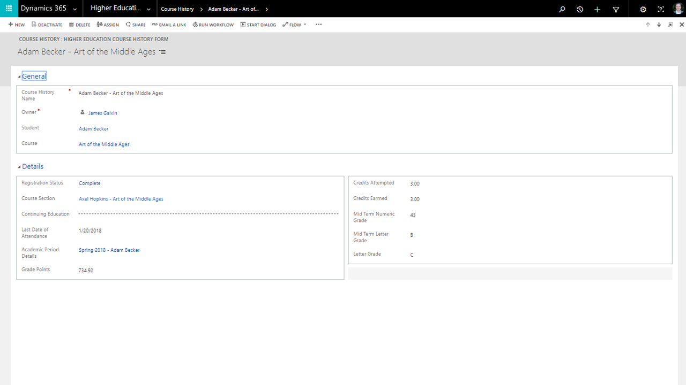

# The Dynamics 365 Higher Education Accelerator

The [Dynamics 365 Higher Education Accelerator](https://appsource.microsoft.com/en-us/product/dynamics-365/mshied.highereducationcommondatamodel?tab=Overview) allows you to develop Higher Education solutions using entities and attributes used by institutions such as students, faculty, courses, test scores, and more. The solution includes entities, fields, forms, views, and dashboards.

The initial release of the Higher Education Accelerator ([announced in October 2018 at EDUCAUSE](https://educationblog.microsoft.com/2018/10/transforming-higher-education-to-address-the-skills-gap/)) provides:
- extensions to the CDM to include concepts for Higher Education, including entity definitions and relationships 
- system views which provide easy access to entities such as student, faculty, extracurricular activities, previous education, test scores, course, academic period, programs, test types, registration status, areas of interest, and more
- Customer Engagement forms such as ones for Student, Faculty, and Course History which can be leveraged or enhanced
- an app to provide a sample of what's possible on the Unified Interface
- example Dynamics 365 dashboards and a Power BI dashboard which provides analytics for completed courses and allows drilling into details on student performance, instructor effectiveness, and course feedback
- support for building additional canvas and model-driven apps in PowerApps
- deployable solution that you can install from AppSource or via GitHub

## Site Map Extensions 
With the Higher Education Accelerator and Dynamics 365, institutions can optimize student and faculty engagement, improve institutional effectiveness, and have the analytics to predict outcomes and gain insights. When the Higher Education Accelerator is installed into Dynamics 365 it transforms the experience into one specifically built for higher education and allows institutions to quickly build PowerApps and Power BI visualizations. 

Higher education institutions can utilize the Accelerator to build their business processes on top of the entities that are provided. The ribbon customizations contain entities to record student, faculty, and alumni interactions, appointments, events, and outreach.  
               
## Entities & Workflows
The Higher Education Accelerator provides a specific set of entities to support the needs of institutions in Higher Education. Below are the entities that have been provided in the solution.

| | | | |
| ------- | -----------------|------------------| ------------|
|Accounts	|Course	|Previous Education	|Student Program Type|
|Contacts	|Course History	|Program	|Student Status|
|Academic Period	|Course Section	|Program Level	|Test Score|
|Academic Period Detail	|Education Level	|Program Version	|Test Type|
|Area of Interest	|Extra Curricular Activity|	Program version Detail	|Area of Study|
|Extra Curricular Participant	|Registration Status	|

## Included Forms and Dashboard
The Dynamics 365 Higher Education Accelerator utilizes out-of-the-box Dynamics 365 entities along with customized entities to make it easier to build new solutions. Below are examples of some of the forms, views, and dashboards which have been created to demonstrate the new entities and data model. 

### Student Form
The student form allows you to see a student 360 form and view in Dynamics 365. The form shows contact information, course load, areas of study, degree, course history, test scores, and more all in context of the app and interface. The student record becomes the record of truth and engagement to deliver the best support throughout the student lifecycle.

                                               
### Course History Form
Included with the Dynamics 365 Higher Education Accelerator is a built-in course history form. In this form you can view Course, Course Section, Instructor, Credit, Grade, and more.    

 
 
### Institutional Dashboard
Included in the Higher Accelerator is a student dashboard in Dynamics 365 and an Institutional dashboard in Power BI. With the institutional dashboard, you gain analytics and insights into students, classes, and key metrics such as students by program and demographics.  

 
## Additional Resources
- Download the Higher Education Accelerator from [AppSource](https://appsource.microsoft.com/en-us/product/dynamics-365/mshied.highereducationcommondatamodel?tab=Overview) 
- The Higher Education data model, solutions, data samples, Power BI examples, SDK extensions, and more are provided as part of the open source creative license and available on [GitHub](https://github.com/Microsoft/Dynamics-365-Industry-Accelerators/tree/master/edu/samplecode/analytics). 
- Additional support topics on the Accelerators can be found [here](https://community.dynamics.com/365/b/dynamics365isvsuccess/archive/2018/08/01/dynamics-365-brings-industry-focus-through-the-microsoft-power-platform-and-solution-accelerators).
- To see some examples of ISVs building solutions on the Higher Education Accelerator please read the blog post [here](https://community.dynamics.com/365/b/dynamics365isvsuccess/archive/2018/10/30/early-isvs-building-on-the-new-higher-education-accelerator-and-the-microsoft-power-platform).
