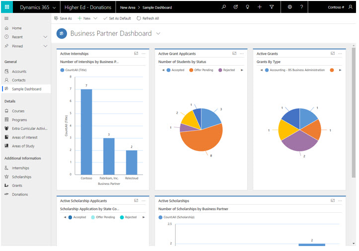
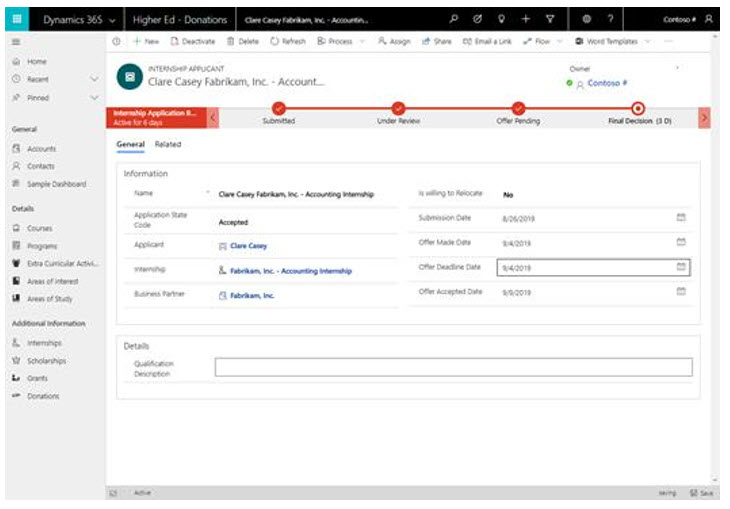

---

title: Dynamics 365 education accelerator higher education component | Microsoft Docs
description: Develop higher education solutions with the extensions to Common Data Model and the built-in forms, views, and dashboards of the Dynamics 365 education accelerator – higher education component.
author: MeenooRami
ms.service: common-data-model
ms.reviewer: Deonhe
ms.topic: article
ms.date: 07/07/2020
ms.author: merami

---

# Dynamics 365 education accelerator – higher education

With the higher education component in the [Dynamics 365 education accelerator](https://appsource.microsoft.com/product/dynamics-365/mshied.educationcommondatamodel?tab=Overview), you can develop solutions that are based on entities and attributes that higher-education institutions use. The component includes entities around student engagement and additional entities around internships, scholarships, grants, and accomplishments. The component also provides entities, fields, forms, views, and dashboards specific to higher education.

## Common Data Model extensions

This accelerator contains extensions to Common Data Model to include concepts for higher education, including entity definitions and relationships:

- A student portal where students can view courses and events, and see the history of courses and applications.
- A business partner dashboard provides information to partner organizations to help them engage with the university for events, hackathons, internships, scholarships, and grants.
- The Accomplishment extension captures any work completed by students outside of a course, such as hackathons or awards.
- The Grants phone app allows research faculty to keep track of applications and approval of grants to which they've applied.
- All personas, including students, business partners, and faculty members, have access to rich reporting on the students applying for internships, grants, and scholarships.
- System views that provide easy access to relevant areas. This includes the following entities: students, faculty, extracurricular activities, previous education, test scores, courses, academic periods, programs, test types, registration status, and areas of interest.
- Sample apps to show some of the possibilities of the unified interface.
- Example Dynamics 365 dashboards and Power BI dashboards that provide analytics for completed courses and allow drilling into details about student performance, instructor effectiveness, and course feedback.
- Support for building additional canvases and model-driven apps in Power Apps.
- A solution that you can deploy and install from AppSource or GitHub.

## Site-map extensions

With the higher education component of the Dynamics 365 education accelerator, institutions can optimize student and faculty engagement, improve institutional effectiveness, predict outcomes, and gain insights from analytics. When the accelerator is installed, the experience is transformed into one specifically built for higher education and one that allows institutions to quickly build Power Apps and Power BI visualizations.

Higher education institutions can build their business processes on top of the entities in the accelerator. The ribbon customizations contain entities to record student, faculty, and alumni interactions, business partner interactions, appointments, events, and outreach.

## Entities and workflows

This accelerator provides these entities to support the needs of higher education institutions.

### Education core

|   |  |                        |
| ------------- | ------------- |----------|
| Account  | Test Type  | Test Score|
| Course History  | Registration Status  | Course |
| Contact |Course Section |Extracurricular Activity |
|Extracurricular Activity Participants |Address / Customer Address |Academic Period |
|Program |Program Level |Academic Period Details |
|Student Status |Internship |Internship Applicants   |
|Accomplishments |Area of Interest |Area of Study |
|Student Program Type |Previous Education |Education Level |
|Scholarship |Scholarship Applicant | |

### Higher education

|   |  |                        |     |
| ------------- | ------------- |----------|-----------|
| Grant  | Grant Applicant  | Program Version | Program Version Detail|
||||

## Forms, dashboards, and apps

The higher education component combines standard Dynamics 365 entities with customized entities to make it easier to build solutions. This section describes some of the forms, dashboards, and apps that demonstrate the new entities and the data model.

### Business partner dashboard

A business partner is any organization that's willing to engage with the university for events, hackathons, internships, scholarships, or grants. With the native dashboard and PowerBI dashboards, business partners gain insights into student interest in opportunities and applications for grants and scholarships.

### Student internship application status form

This form tracks the status of students' internship applications.

### Grants phone app

Research faculty can keep track of grant applications submitted by their students. 

### Student form

This Dynamics 365 form shows student information, such as contact information, course load, areas of study, degree, course history, and test scores, in the context of the app and the interface. The student record becomes the source of truth to deliver the right ongoing engagements for providing the best support throughout the student lifecycle.
<!--note from editor: That last sentence was confusing at "source of truth and engagement". I tried to rework it, but you might be able to do it better. Consider taking out "source of truth" and saying something clearer. -->

### Institutional dashboard

This accelerator includes a student dashboard in Dynamics 365 and an institutional dashboard in Power BI. With the institutional dashboard, you can gain analytics and insights into students, classes, and key metrics, such as *students by program* and demographics.

## Additional resources

- Download the Dynamics 365 education accelerator from [AppSource](https://appsource.microsoft.com/product/dynamics-365/mshied.educationcommondatamodel?tab=Overview).

- The higher-education data model, solutions, data samples, Power BI examples, SDK extensions, and more are provided as part of the open-source creative license, available on [GitHub](https://github.com/microsoft/Industry-Accelerator-Education/releases).

- Additional [accelerator topics](https://community.dynamics.com/365/b/dynamics365isvsuccess/archive/2018/08/01/dynamics-365-brings-industry-focus-through-the-microsoft-power-platform-and-solution-accelerators). 

- This [blog post](https://cloudblogs.microsoft.com/dynamics365/bdm/2020/01/21/enhancements-to-dynamics-365-higher-education-accelerator-now-available/) shares additional enhancements made to the higher education model. 

- Continue your accelerator experience and engage with experts and peers, read blog articles, and find local events within the industry accelerator community. [Join us](https://community.dynamics.com/365/industry-accelerators)
