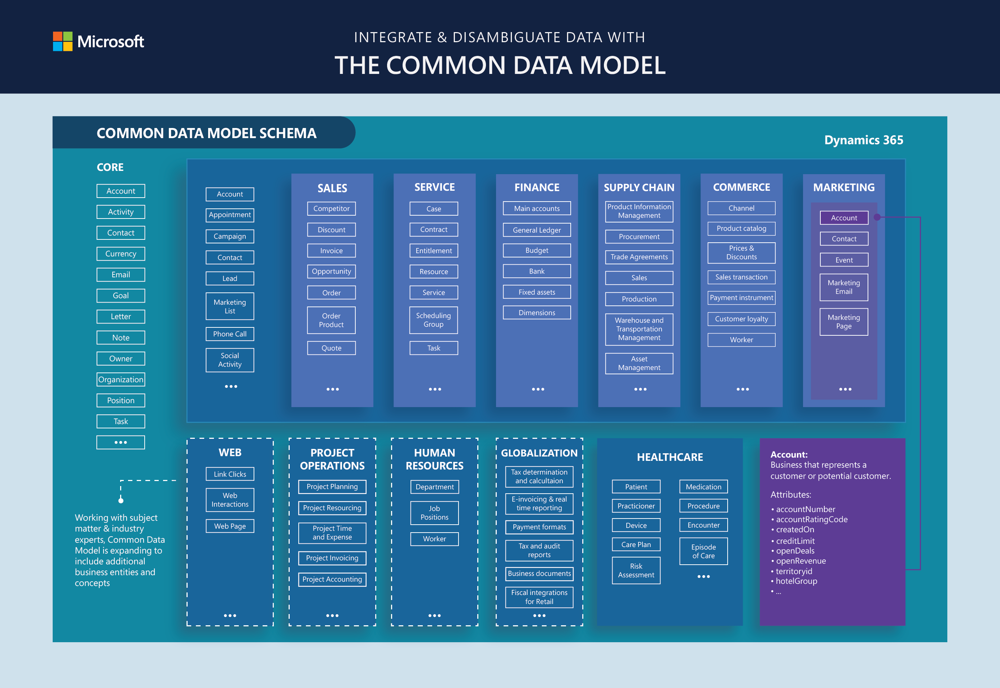

# The Common Data Model

If you've ever had to bring data from multiple systems and applications together, you know what an expensive and time-consuming task that can be. Without being able to share and understand the same data easily, each application or data integration project requires a custom implementation.

The Common Data Model simplifies this process by providing a shared data language for business and analytical applications to use. The Common Data Model metadata system makes it possible for data and its meaning to be shared across applications and business processes such as Microsoft Power Apps, Power BI, Dynamics 365, and Azure.

## What's in the Common Data Model?

In addition to the metadata system, the Common Data Model includes a set of standardized, extensible data schemas that Microsoft and its partners have published. This collection of predefined schemas includes entities, attributes, semantic metadata, and relationships. The schemas represent commonly used concepts and activities, such as **Account** and **Campaign**, to simplify the creation, aggregation, and analysis of data. This graphic shows some elements of the standard entities. More information: [Common Data Model repository on GitHub](https://aka.ms/cdmrepo)

[Download the Common Data Model poster](https://aka.ms/cdmposter)

## Why use the Common Data Model?

Imagine that you have three business apps&mdash;one each for materials, manufacturing, and sales. It's likely that each app was created independently, with different structures to represent an entity, such as **Account**, in nearly (but not quite) the same way. If used the Common Data Model, you would have built your data in a standardized format (using the Common Data Model standard entities, attributes, and relationships) and then each app could use the same data. Of course, each app might have its own additional data and schemas, depending on its functionality. But when it comes to development, your apps and reports can pull common data elements quickly, cleanly, and with confidence.

And what if you need to create a fourth app? Your data will be ready in the Common Data Model schema, so your development efforts can concentrate on business logic rather than data quagmires and sticky transformations.

Historically, the work to build an app has been tightly tied with data integration, but with the Common Data Model and the platforms that support it, the two can happen independently:

- **App makers and/or developers**: Whether these users leverage code-based platforms or a low-code/no-code platform such as Power Apps or Power BI, they need to store and manage data for their apps.

- **Data integrators**: These users are responsible for bringing data from a variety of systems to make it accessible for apps to use.

The Common Data Model simplifies data management and app development by unifying data into a known form and applying structural and semantic consistency across multiple apps and deployments. To summarize the benefits:

- **Structural and semantic consistency** across applications and deployments.

- **Simplified integration and disambiguation of data** that's collected from processes, digital interactions, product telemetry, people interactions, and so on.

- **A unified shape**, where data integrations can combine existing enterprise data with other sources and use that data holistically to develop apps or derive insights.

- **The ability to extend the schema and Common Data Model standard entities** to tailor the model to your organization.

## The Common Data Model in action

Microsoft and its partners use the Common Data Model for their own apps and offerings, and are building additional services and offerings based on Common Data Model schemas. 

Organizations from industries such as healthcare are working closely with Microsoft to extend the Common Data Model to their specific business concepts&mdash;for example, **Patient** and **Care Plan**&mdash;through [industry solution accelerators](industry-accelerators.md). This extends the benefit of the Common Data Model standard entities to these verticals so that industry solutions can interoperate more easily.

## Next steps

[How to use the Common Data Model](use.md): Describes the Common Data Model in detail and discusses use cases for creating data in the model or transforming your existing data into the model.  
[How to create Common Data Model schema documents](creating-schemas.md): Describes how to create custom Common Data Model entity schema documents.   
[Learn more about Industry Accelerators](industry-accelerators.md): Describes the effort around industry extensions and the solutions that Microsoft has already released.  
[The Common Data Model and Microsoft Azure Data Lake Storage Gen2](data-lake.md): Describes how putting data in Common Data Model form and storing it in Azure Data Lake Storage Gen2 helps services in the Azure ecosystem to exchange data.
