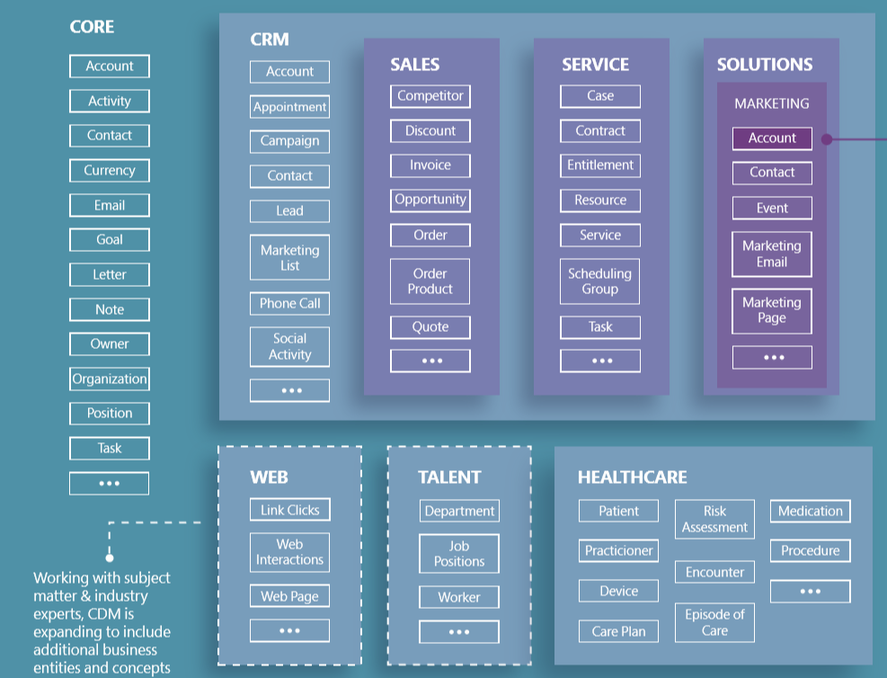

# The Common Data Model

If you’ve ever run into challenges with data that’s *nearly* the same or that *should* work together (and then spent significant effort transforming fields and tables to work with your other data), you know that common data elements can save effort, streamline development, and enable faster analytics. The Common Data Model (CDM) can provide these capabilities and more with products and services such as PowerApps, Power BI, Dynamics 365, and Azure, storing data in conformance with the CDM. 

The CDM is a standardized, modular, and extensible collection of data schemas that Microsoft published to help you build, use, and analyze data. This collection of predefined schemas consists of entities, attributes, semantic metadata, and relationships. The schemas represent commonly used concepts and activities, such as **Account** and **Campaign**, to simplify the creation, aggregation, and analysis of data. This graphic shows some elements of those schemas. More information: [CDM repo on GitHub](https://aka.ms/cdmrepo)

More information: [CDM poster](https://aka.ms/cdmposter)

## Why use the Common Data Model?

The CDM simplifies data management and app development by unifying data into a known form and applying structural and semantic consistency across multiple apps and deployments. In other words, if your data is in the CDM, you can use it in many apps, streamline the creation or use of other apps to use that data, and easily build reports for each of those apps (or all of them). In addition, data integrators who bring data from a variety of systems can focus on landing the data in the CDM, instead of building a different model for each app.

Imagine that you have three business apps – one each for materials, manufacturing, and sales. Often each app would be created independently, with different structures that represent an entity, such as **Account**, in nearly the same way (but not quite). With the CDM, you could build your data in a standardized format (using the CDM entities, attributes, and relationships), and then each app could use the same data as a basis. Of course, each app could have its own additional data and schemas, based on its functionality. But when it comes to development, your apps and reports could pull the common data elements quickly, cleanly, and with confidence.

And what about the need to create a fourth app? Your data is ready, in the CDM schema, so your development efforts can concentrate on
business logic, not data quagmires and sticky transformations.

In other words, the CDM offers these benefits:

- **Structural and semantic consistency** across applications and deployments.

- **Simplified integration and disambiguation of data** that’s collected from processes, digital interactions, product telemetry, people interactions, and so on.

- **A unified shape** where data integrations can **combine existing enterprise data with other sources** and use that data holistically to develop apps or derive insights.

- **Ability to extend the schema and CDM entities** to tailor the CDM to your organization.

You can use the CDM to create data repositories that match the schema, and you can also transform your existing data into the CDM schema. Either way, the efficiency that you get from standardization can expedite and streamline whatever you do next with your data.

## Who uses the Common Data Model?

A variety of customers, partners, and products use the CDM, and all have the same goal of unifying data in a well-known form with semantic meaning.

- **App makers/developers**: Whether these users leverage code-based platforms or a low-code/no-code platform such as PowerApps, they need to store and manage data for their apps.

- **Data integrators**: These users are responsible for bringing data from a variety of systems to make it accessible for apps to use.

Historically, the work to build an app has been tightly tied with data integration, but with the CDM and the platforms that support it, the two can happen independently.

## The Common Data Model in action

Microsoft and its partners use the CDM for their own apps and offerings and are building additional services and offerings
based on CDM schemas. These examples show how organizations use the CDM:

- **Common Data Service (CDS) for Apps**, which supports Dynamics and PowerApps, stores data in conformance with the CDM definition. In fact, many of the original business entities in the CDM came from Dynamics offerings, such as Dynamics 365 for Sales and Dynamics 365 for Marketing.

- **Industry verticals** such as healthcare are working closely with Microsoft to extend the CDM to their specific business concepts, such as **Patient** and **Care Plan** through [Industry Accelerators](industry-accelerators.md). That way, users can can share data and build services so partners can easily exchange data, create interoperable apps and services, and create quick analytics that are easy to share.

- **Power BI Dataflows** allows you to ingest data into the CDM form from a variety of sources such as Dynamics 365, Salesforce, Azure SQL Database, Excel, or SharePoint. Once you've connected and prepared your data, you can choose to map it to a CDM standard entity or load it as a custom entity in CDM form in Azure Data Lake Storage Gen2.

## Next step

[How to use the Common Data Model](use-common-data-model.md): Describes the CDM in detail and discusses use cases for creating data in the CDM or transforming your existing data into the CDM.
