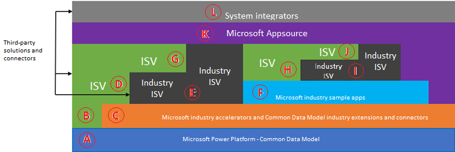

# Overview of industry solution accelerators

The Common Data Model enables horizontal consistency for customers' business data, making it easier for them to create value from that data. However, many customers and partners want solutions and platforms that are tailored for their industry. Microsoft is working closely with representatives from various industries to make the Common Data Model more relevant to them, by creating industry solution accelerators.
<!--This is the only article in the conceptual section that refers to Microsoft Power Platform. Is that the branding we want to move toward throughout the articles? Should we define it here, or maybe link to the main powerplatform page on Msft.com?-->
[Industry solution accelerators](https://community.dynamics.com/365/b/dynamics365isvsuccess/archive/2018/08/01/dynamics-365-brings-industry-focus-through-the-microsoft-power-platform-and-solution-accelerators) are foundational components within the Microsoft Power Platform and Dynamics 365 that enable ISVs and other solution providers to quickly build industry vertical solutions. The accelerators extend the Common Data Model to include new entities to support a data schema for concepts within specific industries. Microsoft is currently focused on delivering accelerators for the following industries, with others to come:

-	[Automotive](automotive-accelerator.md)
-	[Banking](banking-accelerator.md)
-   [Healthcare](health-accelerator.md)
-	Education, including [higher education](hied-accelerator.md) and K&ndash;12
-	[Nonprofit](nfp-accelerator.md)
-	Media

## ISV opportunity view
Microsoft Power Platform combines with industry solution accelerators to create a unique opportunity for ISVs to provide solutions for different scenarios and levels of development. This image shows the opportunities for ISVs who build on top of the platform and the solution accelerators.
<!--About the text labels in the following graphic: "SI" should be "System integrators." "Microsoft Industry Sample Apps" should be "Microsoft industry sample apps." "Microsoft Industry Accelerator - CDM Industry Extensions & Connectors" should be "Microsoft industry accelerators and Common Data Model industry extensions and connectors." I don't know what the hyphen in the bottommost label is trying to say. Should it be "Microsoft Power Platform (Common Data Model)", "Common Data Model (Microsoft Power Platform)", or can it simply be "Common Data Model"? Also, the callout should be "Third-party solutions and connectors".-->

<!--What do you think of organizing the explanatory text this way? I was going to suggest adding numbers off to the side of the layers, but then I realized that the point of the graphic is actually conveyed by the color blocks, not so much the layers.-->
|           |            |
|-----------|------------|
| **A** | The Common Data Model is the foundation on which the Microsoft Power Platform accelerators and other solutions are built or extended from. <!--Edit okay? As noted above, I was confused by what the hyphen between Microsoft Power Platform and the Common Data Model was signifying.--> |
| **B**, **C** | ISV solutions extend the Common Data Model, as do industry solution accelerators from Microsoft and its partners.|
| **D**,&nbsp;**E**,&nbsp;**F** | ISVs, industry ISVs, and industry sample apps from Microsoft all extend the Microsoft industry solution accelerators.|
| **G** | ISVs further extend industry ISV solutions that were built on top of the Microsoft industry solution accelerator.|
| **H**, **I** | ISvs and industry ISVs further extend industry sample apps that were built on top of the Microsoft industry solution accelerator. |
| **J** | ISVs further extend industry ISV solutions that were built on top of the industry sample apps from Microsoft.|
| **K** | Accelerators&mdash;along with ISV, industry ISV, and industry sample app solutions&mdash;are made available on AppSource.|
| **L** | System integrators provide expertise for customer, ISV, and industry ISV solutions that were built on top of the Microsoft industry solution accelerators. System integrators can create industry vertical solution support and practices that can help customers directly, build their own solutions and tools, or support ISV deliveries.|

As the image shows, from the bottom level on up through the stack, ISVs have multiple opportunities to deliver industry-focused apps and solutions. These opportunities exist whether you're building directly on Power Apps (Common Data Service) or Dynamics 365 apps. Each level further expands the opportunities at the next level up. The accelerators provide opportunities to rapidly build vertical, industry-focused apps, in addition to enabling system integrators to help scale and support these new apps and solutions.

<!--Please check the following link. I thought it would be nice to point the reader somewhere, but maybe there's a better place than this one specifically for accelerators?-->
## Additional accelerators
We continue to release new and updated accelerators for the industries identified earlier. Check out [our release plans](https://dynamics.microsoft.com/en-us/business-applications/product-updates/) for the most recent releases!

## Want to help?
If you're interested in talking with Microsoft about the industry solution accelerators, [sign up](https://experienceisv.microsoftcrmportals.com/engage/) to share your feedback, suggestions, and challenges.
