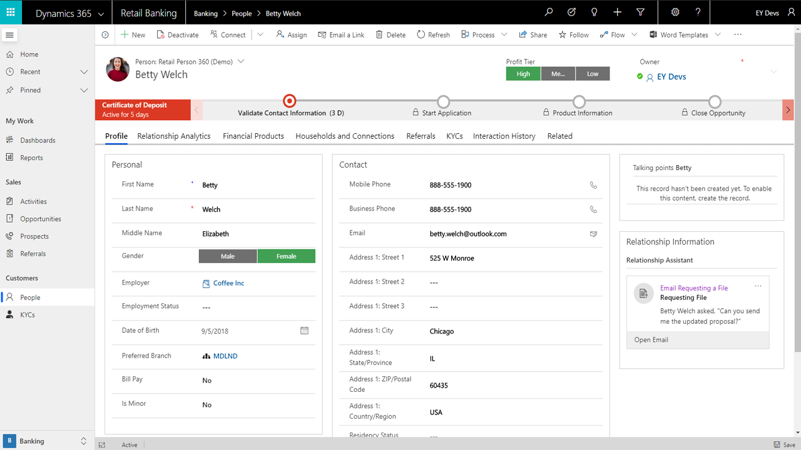

# Dynamics 365 Financial Services Accelerator - Insurance

The insurance component in the [Dynamics 365 Financial Services Accelerator](https://appsource.microsoft.com/product/dynamics-crm/msfsi.bankingcommondatamodel?tab=Overview) expands the Common Data Model and the Microsoft Power Platform for the insurance industry. The insurance component includes data entities and attributes which span both property and casualty and life insurance and for both producer and agency management use cases. 

The component includes prebuilt solutions, applications, and dashboards for the producer/agent experience as well as for optimizing agency operations. The insurance component integrates seamlessly with the Dynamics 365 Sales application to deliver differentiated policy holder experiences including business processes such as quoting and policy issuance, renewing policies, servicing claims, and recommending insurance products. Additionally, the insurance component can be used alongside the banking component in the Financial Services Accelerator for scenarios and use cases where banking data might be useful.

Currently in preview, the goal of this release is to validate the insurance data model and ensure it meets our customers and partners use cases, the preview of the insurance component includes the following features:

- New insurance entities in the Microsoft Common Data Model which include concepts for insurance spanning the insurance customer, producer, and agency. 
-	An insurance agent application and dashboards, addressing:
  - Policy Management
  - Claims Servicing
  - Customer 360 and customer onboarding
  - Agent Dashboard
-	A Test Drive experience through [AppSource](https://appsource.microsoft.com/en-us/product/dynamics-365/msfsi.bankingcommondatamodel?tab=Overview) with walkthrough and sample data.
-	A Package deployer solution that is available by filling out this form [here](https://experience.dynamics.com/accelerators/). 

## Sitemap extensions

With the Banking component, you can optimize the customer experience, improve collaboration within the bank, and gain insights from analytics. When this component is installed into Dynamics 365, the experience is transformed into one specifically built for banks and it allows institutions to quickly build Power Apps and Power BI visualizations.

Banks, ISVs, and others in Financial Services can build their solutions and business processes on top of the new entities found within the Banking component. The current data model supports common banking activities but has been designed to allow flexibility for other use cases in Financial Services. The data model was developed in collaboration with [BIAN](https://www.bian.org/) and other open API initiatives to ensure interoperability to help unlock new Open Banking opportunities.

## Entities and workflows

This Banking component provides the following entities and more to support the needs of banks and others in Financial Services:

| | | |
| ------- | -----------------|------------------|
|Companies |Financial Products |Banks |
|People |Commercial Loans |Branches |
|Prospects |Mortgages |Syndicates |
|Referrals |Home Equity  |Collateral |
|KYC |Checking Accounts | Limits |
|Opportunities |Deposit Accounts | Commercial Deals |

## Forms and dashboards

The Financial Services Accelerator can be used with Power Platform or combined with standard Dynamics 365 entities to make it easier to build solutions. This section describes just a few of the forms, views, and dashboards that demonstrate how it extends the Common Data Model,  Power Platform, and Dynamics 365 for Banking.

### Customer 360 form

This banking Customer 360 view shows everything about the person from their profit tier (segmentation), to interaction and activities, to KYC, what financial products they have, and who is within their household. The person (or company) record becomes the source of truth and engagement to deliver the optimal customer experience.

### Opportunity and deal form

The opportunity and deal forms show the details of the opportunity included products, requested facilities, limits, and the stages of the overall proposal.

### Branch Manager dashboard

Example dashboards both in Dynamics 365 and Power BI are included. For example the Bank Branch Manager dashboard, the Bank Branch Manager gains analytics and insights into account applications, onboarding stage, referrals and prospects, and which products are most popular.

## Additional resources

- Find the Financial Services Accelerator here on [Microsoft AppSource](https://appsource.microsoft.com/en-us/product/dynamics-crm/msfsi.bankingcommondatamodel?tab=Overview).

- The Financial Services Accelerator is provided as part of the open-source creative license and available on [GitHub](https://github.com/microsoft/Industry-Accelerator-FinancialServices).

- Refer to this [blog post](https://https:/cloudblogs.microsoft.com/dynamics365/bdm/2019/07/17/microsoft-dynamics-365-banking-accelerator-is-now-generally-available/) to read more about the value of the Banking component to ISVs, banks, and other financial services institutions.

