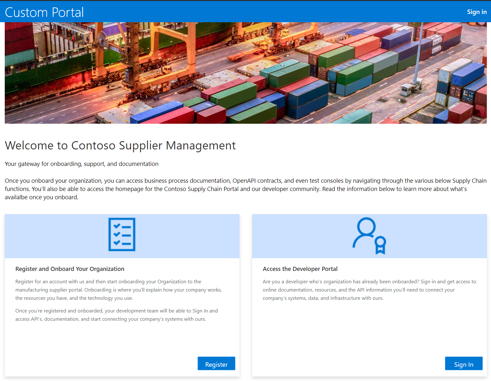

---

title: Dynamics 365 Manufacturing Accelerator (preview) | Microsoft Docs

description:  Develop manufacturing solutions with the extensions to the Common Data Model and built-in forms and views of the Dynamics 365 Manufacturing Accelerator.

author: MeenooRami
ms.service: common-data-model
ms.reviewer: v-dehaas
ms.topic: article
ms.date: 05/01/2020
ms.author: merami

---

# The Dynamics 365 Manufacturing Accelerator (Preview)

[!INCLUDE[cc-beta-prerelease-disclaimer](./includes/cc-beta-prerelease-disclaimer.md)]

## Overview
The initial Preview of the Manufacturing Accelerator enables manufacturers to quickly develop solutions or extend our sample applications to fit your business needs related to intelligent supplier relationship management and onboarding. 
We provide a manufacturing data model, sample power portal, sample apps, automated templates, and Power BI dashboards to create a seamless role-based supplier qualification, API onboarding, and supplier management console experience. This accelerator will enable all manufacturing organizations to digitize this process within hours using our low-code no-code platform capabilities.

The accelerator includes the following features via Power Apps Portals:

- Enable new suppliers to contact a manufacturer
- Qualify a new supplier
- Enable API data integration onboarding
- Maintain and provide ongoing visibility into supplier transactions
- Maintain and provide ongoing visibility into API data exchange
The accelerator includes the following features via a model-driven app:
- Manage and approve access requests
- Manage and approve supplier requests
- Manage and track supplier health

The supplier relationship management scenario as part of the Manufacturing Accelerator puts the full strength of the Power Platform to use helping manufacturing organizations to optimize their supplier and sales relationships and more effectively enabling them to manage those important supplier relationships.

## Site-map extensions

The Manufacturing Accelerator can be used with Microsoft Dynamics 365 or independently with the core solution layer that is not dependent on Microsoft Dynamics 365. This independent solution layer can be leveraged to build Model driven and Canvas based Power Apps applications.

When the accelerator is installed into Dynamics 365 it enables you to optimize supplier operational processes including PO, expected receipts, and invoicing based on the IATI standard. You can also leverage the entire solution within Dynamics 365.
The manufacturing data model is developed in collaboration with partners, industry experts and open initiatives to ensure interoperability and accelerate supplier impact.

## Entities and workflows
This accelerator includes these entities to support the supplier relationship management scenario:

**Supplier Onboarding**|**Questionnaire Framework**|**Electronic Communication**|**Workflow**|**Process**|**Power automate**
:-----:|:-----:|:-----:|:-----:|:-----:|:-----:
Account|Question|Account Communication Configuration|Assign Supplier Web Role|Approval process|Add External User
Contact|Questionnaire Question| |Populate decision fields| | 
Access Request|Questionnaire Template| | | | 
Access Request Approval|Questionnaire Template Question| | | | 
Capability Type|Vendor Questionnaire| | | | 
Certification Type| | | | | 
Credit Rating| | | | | 
Department| | | | | 
Identifier| | | | | 
Product Classification| | | | | 
Vendor Capability| | | | | 
Vendor Certification| | | | | 

## Forms and dashboards

The Dynamics 365 Manufacturing Accelerator combines standard Dynamics 365 entities with customized entities to make it easier to build solutions. This section describes some of the forms, views, and dashboards that demonstrate the new entities and the data model.

The initial access request from a registration form is to initiate the conversation with a manufacturing organization regarding the intent to be a new supplier of parts or products. The accelerator includes an extensible model for manufacturing organization to enable Azure Active Directory authentication or replace this with any other authentication type:

The portal experience focuses on supporting two personas, a business development manager from a potential new supplier and the supplier IT administration team. If you are  seeking to be a new supplier then you start a new registration process. However, if you are currently an existing supplier and would like to get your development team connected you can do so via API data integration through the portal.

The model driven experience focuses on the Manufacturers administrative needs and where the procurement department largely manage the suppliers.

This section provides examples of the forms and dashboards that demonstrate the entities in the data model for the Accelerator.

## New supplier registration
The supplier management functionality of the Portal will allow new Suppliers to access the site, by clicking on the “Register” button to apply as a new Supplier and to proceed with the approval process.

> [!div class="mx-imgBorder"]
> 

After you select **Register**”, the supplier will need to fill out the basic information on a registration form to begin the approval process, as shown here:

> [!div class="mx-imgBorder"]
> 