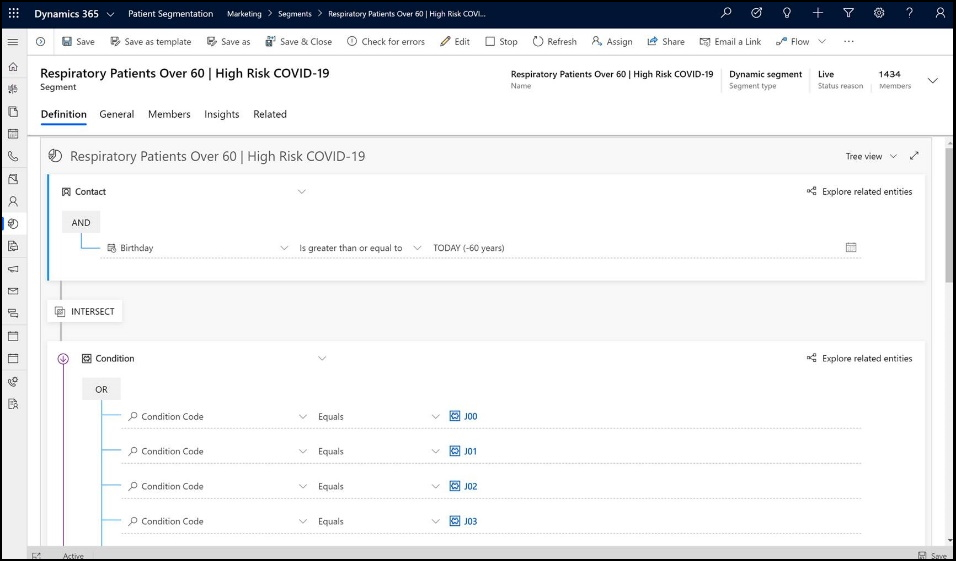
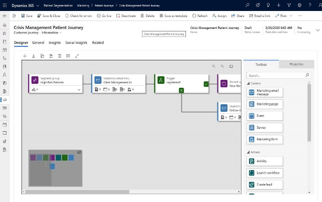
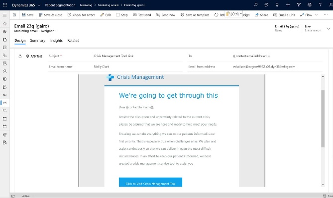
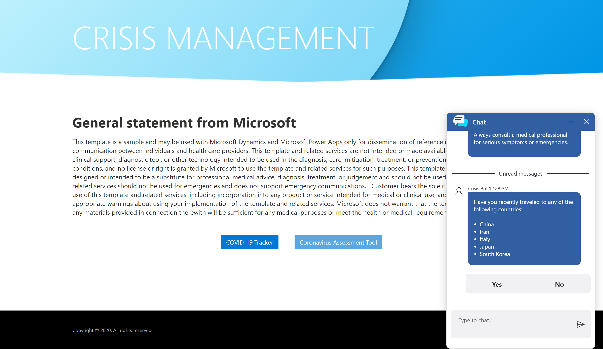
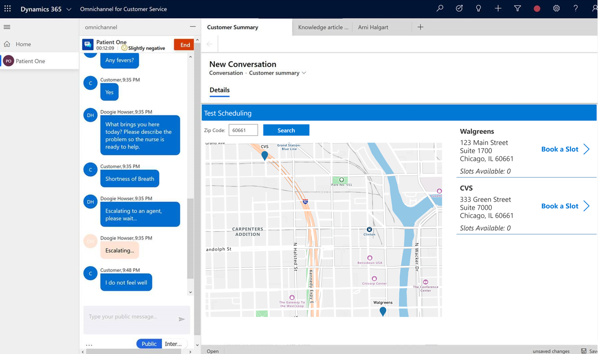
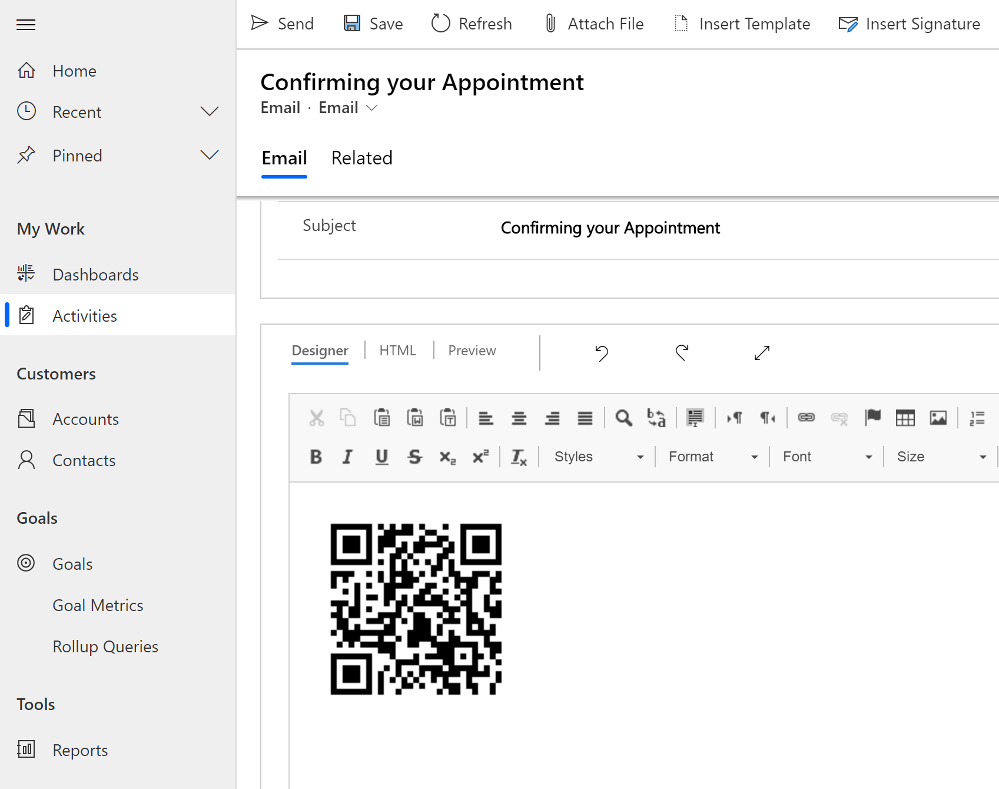
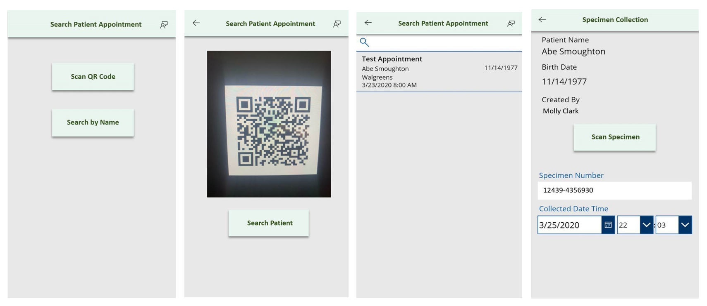

# Use the Patient Scheduling and Screening Template

In an effort to streamline patient scheduling and screening measures to help
more efficiently combat the COVID-19 pandemic, the Patient Scheduling and
Screening template provides a robust, yet easy-to-use baseline for providing
these capabilities to organizations.

## Prerequisites

To get started with the app, you need to download ensure the following has been
done for users of the solutions within the template:

-   Ensure **Patient Outreach** users have either **Marketing Manager** or **Marketing
    Professional** security role in your environment

    

-   Ensure **Omnichannel Contact Center** users have **Customer Service app
    access**, **Customer Service Representative** roles. Along with this, the users
    will need **Omnichannel administrator**, **Omnichannel agent** or **Omnichannel supervisor** roles.

    

To get started with the **Screening app** included in the solution, you need to
download the Power Apps Mobile on your device using the device's app store.

-   **Download** the [Power Apps
    Mobile](https://powerapps.microsoft.com/downloads)

-   For **Apple** devices with iOS such as iPhone and iPad, use [App
    store](https://aka.ms/powerappsios)

-   For **Android** devices, use [Google Play](https://aka.ms/powerappsandroid)

After you install the Power Apps Mobile, open the app from your device and sign
in with your company's Azure Active Directory account. You can view all apps
shared to you by your organization once you sign in. For more information, see
[Power Apps mobile device sign
in](https://docs.microsoft.com/powerapps/user/run-app-client#open-power-apps-and-sign-in).

## Demo: Patient Scheduling and Screening Template

Watch a quick demo on how to use the Patient Screening and Scheduling Template.

**VIDEO**

## Patient Outreach

To provide tools to allow for organizations to proactively provide outreach to
at-risk patient populations, the **Patient Outreach** module in the Patient
Scheduling and Screening template will encompass template patient segments for
organizations to compile a marketing segment in order to reach out to these
patients. Leveraging the core Healthcare Accelerator solution to store patient
clinical data in CDS, we are able to utilize conditions and the corresponding
ICD-10 code in order to formulate the segment. The Patient Segments included
within the solution are as follows:

-   Respiratory Patients over 60

-   Cardiac Patients over 60

-   Compromised Immune System

These templates are meant to provide a baseline to be expanded upon or
configured to meet the organizations individual needs for patient outreach.

## Patient Journeys Email Templates

*Patient Journeys*

*Email Templates*

Also, included with the **Patient Outreach** module is a Crisis Management Journey
and baseline marketing email template to provide the proactive outreach to the
predefined or newly created patient segments. This provides Patient Outreach
specialists the ability to utilize a multitude of channels including email, SMS,
surveys and social channels for proactive outreach and ongoing communications.

## Patient Portal & Assessments

As a part of the Patient Scheduling and Screening template, it is paramount to have
landing spot for patients to be able to search knowledge base articles for
information regarding COVID-19 as well as take a self-assessment to understand
their risk. The template provides a baseline portal that an organization can
take a configure to meet their individual needs. It also encompasses the ability
to embed Microsoft Healthbot Service to perform an assessment leveraging the
COVID-19 CDC Template embedded in the Healthbot.

## Omnichannel Contact Center

The Microsoft Healthbot Service provides a simple mechanism to transfer at-risk
patients to Omnichannel for Customer Service to receive additional care. From
within Omnichannel for Customer Service, call center agents have the ability to
view the full transcript of the patient interaction as well as built-in
sentiment analysis. Also included in the template, is a mechanism to perform a
search via zip code to find the closest testing center as well as providing the
slots that are open for booking at the location.

## Patient 360 in Omnichannel Test Scheduling

## Appointment Automation

After the appointment is booked, the template provides automation that send the
patient a text or email (based on their preferred method of communication) with
details of the appointment and a QR/Bar Code for entry at the testing center.
This ensures that patients and testing centers are provided a secure mechanism
to receive screening.

## Screening app

Utilizing a purpose-built canvas PowerApp the test Technician can search for the
patient record by last name or by scanning the QR/Bar Code that was provided
through the automation workflow above. Once the appointment and patient
information are retrieved, the Technician can create a new Observation and
capture necessary information while collecting specimen for testing. Once the
specimen is in container, Technician can scan the barcode on the specimen to
link the observation, patient, and specimen.

## Issues and feedback

-   To report an issue with the Patient Scheduling & Screening sample app
    template, visit this
    [link](mailto:dynindaccsupport@microsoft.com?subject=Assistance%20for%20Health%20Care%20Accelerator%20from%20Appsource).

-   If you would like to engage with us to build on the accelerator, visit this [link](https://aka.ms/cdmengage).

