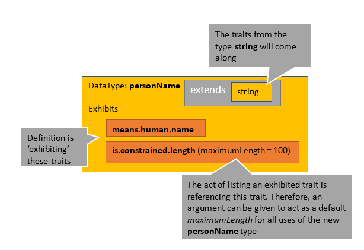
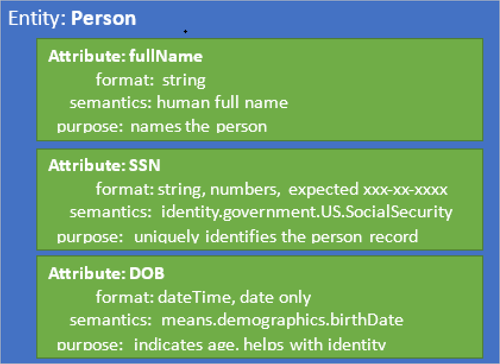
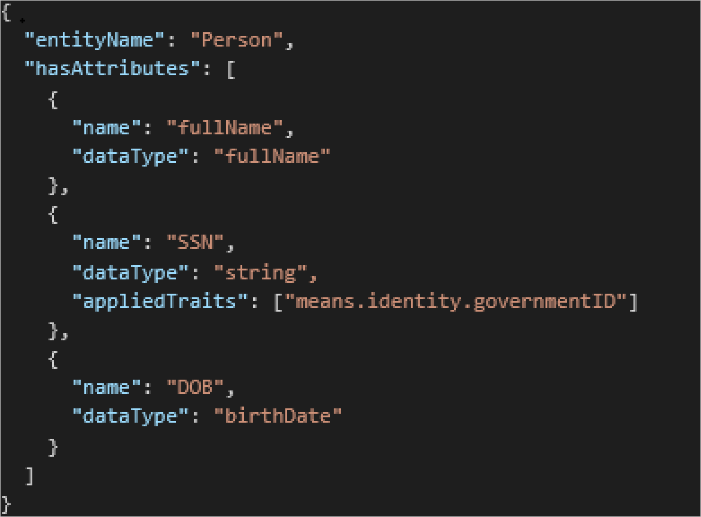
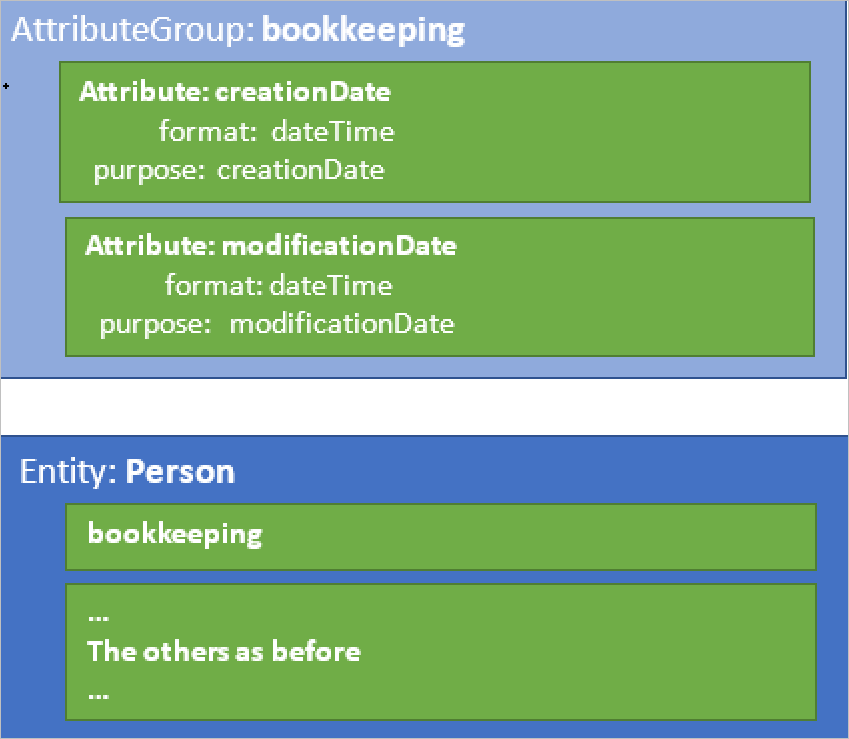
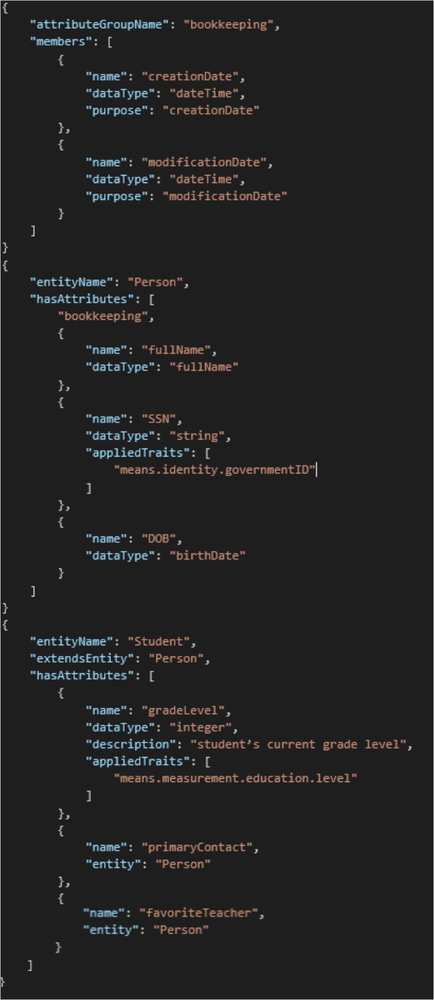
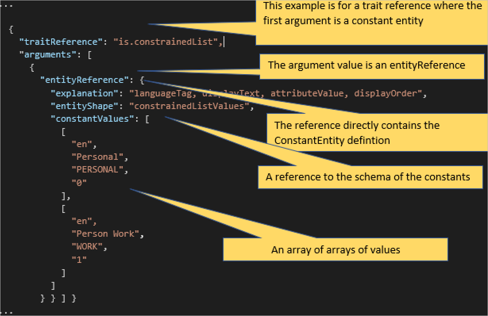

# Logical definitions


## Glossary of definable objects


-   **Trait** - Annotation objects that are an expression of semantic meaning. Traits can hold a set of named argument values.

-   **DataType** - A named collection of traits to represent commonly used concepts that combine data format, data value constraints, and semantic meanings. Example data types are **integer** and **firstName**.

-   **Attribute** - A simple (data type) or complex (entity) typed and named description of data values being used to represent a specific idea or purpose. For example, the data type **firstName** can be used to make an attribute called **partnerFirstName**.

-   **Entity** - A container that holds together a collection of traits and attributes so that the collection represents some logical concept, business process, event, or another object. Customer, Purchase, and Task are examples.

-   **Purpose** - A named collection of traits to represent commonly used reasons or uses that an attribute serves within an entity. The purpose can be a part of the entity definition to identify ideas like "default display text," "primary key," or "default sort column."

-   **AttributeGroup** - A named collection of attributes that works like a macro.

-   **ConstantEntity** - An association between an entity schema and a constant array of data values that exist only within the metadata documents. Used to represent tables of values.

## Definition documents 

The definitions of logical objects in Common Data Model such as entities, data types, and traits are found in definition documents (myDefs.cdm.json). Definition documents can import other definition documents upon which they depend. The main content of a definition document is an array of object definitions.

## Base classes

All the objects in the object model for Common Data Model share a set of common properties and methods; these are factored into the Common Data Model object base class. Most Common Data Model objects represent either the definition of an object or the use of (reference to) a defined object.

### Common Data Model object

| Property / Method           | Description                                                                                                         |
|-----------------------------|---------------------------------------------------------------------------------------------------------------------|
| ObjectType                  | The Common Data Model object type for the object. Read-only.                                                        |
| InDocument                  | The document object in which the object is defined.                                                                 |
| AtCorpusPath                | The corpus path to the specific object.                                                                             |
| Copy()                      |                                                                                                                     |
| Validate()                  | Structural validation of the object settings and properties.                                                        |
| FetchObjectDefinition()     | Returns this definition type object or the definition object that's being referenced by this reference-type object. |
| FetchObjectDefinitionName() | Returns the name of the defined object that would be returned by **FetchObjectDefinition**.                         |

### Common Data Model object definition

| Property / Method | Description                                                                                 |
|-------------------|---------------------------------------------------------------------------------------------|
| GetName           | Returns the name of the defined object.                                                     |
| IsDerivedFrom     | Returns **True** if the defined object is an extension (at some point) of the named object. |
| Explanation       | Space to hold documentation for the object.                                                 |
| ExhibitedTraits   | A list of trait references explaining the traits that a definition exhibits by default.     |

### Common Data Model object reference

| Property / Method | Description                                                                                                                  |
|-------------------|------------------------------------------------------------------------------------------------------------------------------|
| AppliedTraits     | A list of trait references for the traits that are being added to the referenced object only for this instance of the usage. |
| NamedReference    | The name or relative path to the defined object being referenced.                                                            |
| ExplicitReference | The definition of an object can sit directly inside the reference being made.                                                |

## Traits

A *trait* is a simple object that describes a semantic meaning, settings, or measurement. Consider the following example.

```json
{
   "traitName":"means.measurement",
   "explanation":"The root trait for all measurements."
},
{
   "traitName":"means.measurement.distance",
   "explanation":"A measurement of distance with a unit of measure.",
   "extendsTrait":"means.measurement",
   "hasParameters":[
      {
         "name":"units",
         "explanation":"The unit of measure for the distance values",
         "required":true,
         "dataType":"string"
      }
   ]
},
{
   "traitName":"means.measurement.distance.meters",
   "extendsTrait":{
      "traitReference":"means.measurement.distance",
      "arguments":[
         {
            "name":"units",
            "value":"Meter"
         }
      ]
   }
}
```

1.  By convention, trait names describe the meaning and domain of the trait by using a *word.word.word* format. As part of the convention, the first word is either a namespace identifier (for custom extensions) or the verb **is**, **does**, or **means**.

1.  A best practice is to give traits an explanation that makes it clear when or where they should be applied.

1.  Traits can be defined as extensions of a base trait. This creates an inheritance hierarchy that allows for mixing specific and general expressions of meaning. For example, if **means.measurement.distance** extends **means.measurement** and **means.measurement.temperature** also extends **means.measurement**, any object that exhibits either of the more specific traits for distance or temperature can also be seen to have the **means.measurement** trait. This can be useful for searching or grouping.

1.  Traits can define a set of named parameters that give additional details about the trait or a setting..

1.  Trait parameters have a name and explanation, can be required or optional, can have default values, and have an expected data type.

1.  The data type for a trait parameter can be any of the **dataType** objects defined in the corpus.

1.  A trait that has been defined, such as **means.measurement**, can then be applied or used by making a reference to the defined trait.

    1.  An example of a simple trait reference is the use of **means.measurement** as the base—or extended trait—for the **means.measurement.distance** trait.

    2.  A structured reference to a trait, which describes the base trait for **means.measurement.distance.meters** as shown in the preceding example, allows trait arguments to be set for that specific use of the trait.

    3.  The supplied trait arguments correspond to the defined trait parameters, including the trait parameters that might be inherited from a base trait.

    4.  A trait argument can be a simple string value. This assumes that values are set on parameters in the order in which they were defined, starting from the "deepest" base trait on up.

    5.  Another way to specify trait arguments is with **name** and **value** pairs in an object.

    6.  Trait arguments for simple values are always expressed as strings, even if the trait parameter has a data type of **integer**, **Boolean**, or so on.

    7.  Trait argument values for complex types like attributes or entities can be objects.

1.  In this example, because the base trait parameter for **units** is set to **Meters**, when any other object has this **means.measurement.distance.meters** trait applied to it, the **units** argument will always be **Meters**.

For detailed guidance on traits, including their use case, how they are described, and how they are applied, please read [Trait concepts and use cases - a detailed overview of traits for representing dataTypes](trait-concepts-and-use-cases.md).   

## Trait specifics


| Property / Method | Description                                                                                                        |
|-------------------|--------------------------------------------------------------------------------------------------------------------|
| traitName         | The name.                                                                                                          |
| extendsTrait      | A trait reference to a trait which this trait extends. This trait will inherit all parameters from the base trait. |
| parameters        | A list of parameters for holding values or settings with the trait.                                                 |
| elevated          | An elevated trait will move from an attribute to a containing entity.                                              |
| ugly              | Just a flag. Some traits are optimized for internal use and shouldn't necessarily be displayed to users.          |

## Trait parameters


| Parameter    | Description                                                                                                                                 |
|--------------|---------------------------------------------------------------------------------------------------------------------------------------------|
| Name         | A unique name for the parameter. This name can be used to set argument values when referencing traits.                                      |
| DefaultValue | A default value for the parameter that will be used if no corresponding arguments are set.                                                  |
| DataTypeRef  | A Common Data Model data type describing the meaning and shape of the values that can be represented by this parameter.                     |
| Required     | If **True**, Common Data Model will report an error if a trait is being referenced and no value has been set as an argument for this trait. |

### Applying traits

When an entity or other object is defined in Common Data Model, part of its definition can be the set of traits that the object will exhibit—meaning that any time the object is used by reference, it will have those traits.

In the places where an object is used by reference, additional traits can be applied. These additional traits will sit along with the object's exhibited traits. Applying a trait to an object reference overrides the parameter values of the identically named trait that's exhibited by the object. For example, the following trait **is.constrained** is extended.

 


This results in a trait called **is.constrained.length** that can be applied to an attribute to help understand the attribute's limitations. The extended trait has an *Enforced* parameter that tells us whether the length constraint is enforced by a source system (the default value here is **True**), along with a *maximumLength* parameter that's required to be set to a known maximum for an attribute.

When an attribute is defined by using this trait, the attribute-specific maximum length can be set.

 

## Standard traits

The standard definition documents for Common Data Model (primitives.cdm.json, foundations.cdm.json, and meaning.cdm.json) contain a number of predefined standard traits that should be used or extended to help create a shared understanding of metadata from different systems. These standard traits define data formats, data shapes, usage guidance and restrictions, semantic meanings, and structural information about the relationships within the entity itself. Some standard examples are described in the following table:

| Trait name                        | Description                                                                                                                                                                                                                                               |
|-----------------------------------|-----------------------------------------------------------------------------------------------------------------------------------------------------------------------------------------------------------------------------------------------------------|
| is.dataFormat.integer             | Part of the **dataFormat** set of traits. This indicates that the attribute represents whole numbers.                                                                                                                                                     |
| means.identity.entityId           | An attribute that holds an identifier (primary key) value for an entity.                                                                                                                                                                                  |
| is.required                       |                                                                                                                                                                                                                                                           |
| is.cdm.entityVersion              | The version number for the schema of an entity.                                                                                                                                                                                                           |
| is.localized.displayedAs          | The display name for an attribute or entity. Holds a table of language-specific strings.                                                                                                                                                                  |
| is.correlatedWith                 | The values found in the tagged attribute are correlated with the values from another indicated attribute.                                                                                                                                                 |
| means.calendar.dayOfWeek          | Part of the **Calendar** set of traits, this indicates the day of the week. Note that the data values can be **Mon, Tues** or **0,1,2** and this trait will still be valid. The data shape is defined by another trait such as **is.dataFormat.integer**. |
| means.demographic.maritalStatus   | Marital status. As with similar traits, such an attribute might also be constrained to a list of enumerated values to choose from.                                                                                                                        |
| means.formatting.font.size        |                                                                                                                                                                                                                                                           |
| means.idea.product                | An entity that holds product information.                                                                                                                                                                                                                 |
| means.location.city               | The name of a city.                                                                                                                                                                                                                                        |
| means.measurement.distance.inches | Inches, but also measurement and measurement of distance.                                                                                                                                                                                                 |
| means.identity.person.fullName    |                                                                                                                                                                                                                                                           |
## The dataType object

The **dataType** object that's referenced as a part of defining an attribute or a trait parameter is just a convenient mechanism for giving a meaningful name to a collection of traits, some of which might have specific parameter values set. When an attribute is defined by using a data type, the attribute will gain the traits of the data type. The kinds of traits used to make data types should be about the format, meaning, or shape of individual data values.

Data types can extend other data types, in which case they gain (and can augment) the traits taken from the base data type. For example, we define:

 

## Standard data types

The standard definition documents for Common Data Model (primitives.cdm.json, foundations.cdm.json, and meaning.cdm.json) contain a number of already defined data types that should be used or extended to help create a shared understanding of metadata from different systems. Some examples are included in the following table:

| dataType name | Description                                                                         |
|---------------|-------------------------------------------------------------------------------------|
| Float         | Exhibits **dataFormat.floatingPoint**.                                              |
| Binary        | Extends the **byte** data type and adds the **is.dataFormat.array** trait.          |
| Entity        | Values are expected to point to a Common Data Model entity object.                  |
| Year          | Extends the integer calendar part type and adds a trait about meaning year numbers. |
| languageTag   | A string, but also a BCP47 language tag.                                            |
| Inches        | A double with the **measurement.distance.inches** trait.                            |

The following JSON excerpt is an example of how to define a data type:

 

## Entities and their attributes

The primary object described by Common Data Model is the entity. An entity describes the structural shape and semantic meaning for records of data. Entities can represent physical objects, locations, interactions, individuals, point-in-time measurements, and more.

A given entity describes the meaning and shape of data through a set of attributes. There are two kinds of attributes: the atomic, simple type and the more complex, composite type.


>[!NOTE]
>We refer to the attributes of an entity as objects, but logically they're more like connections between objects or events. They describe the act of associating some semantically described data values with the entity.

## Simple, typed attributes

The first kind of attribute describes an individual, atomic piece of data that has a single name, data format, semantic meaning, and purpose within the entity.

 

These attributes are described in the following JSON excerpt:

 

## The Purpose object

Beyond the data format or semantic meaning of an attribute's data values, we might need to describe the reason that an attribute is included in the entity or what purpose it serves. The **Purpose** object in Common Data Model is used to describe such meaning. Structurally and syntactically, a purpose is identical to a **dataType** object. It gives a meaningful name to a collection of traits. When an attribute is defined by using a purpose, the attribute gains the traits of the **Purpose** object. A **Purpose** object can extend base **Purpose** objects, in which case it also gains the traits of the base.

Often, the traits on a **Purpose** object are elevated, meaning that they will also appear on the entity that contains the attribute.

## Standard Purpose objects

The standard definition documents for Common Data Model (primitives.cdm.json, foundations.cdm.json and meaning.cdm.json) contain a number of predefined **Purpose** objects that should be used or extended to help create a shared understanding of metadata from different systems. Some examples are included in the following table:

| Purpose name        | Description                                                                                         |
|---------------------|-----------------------------------------------------------------------------------------------------|
| hasA                | This is the root, "void" purpose, which adds no traits.                                             |
| identifiedBy        | Indicates the primary key of an entity.                                                             |
| namedBy             | The tagged attribute holds the primary name for an entity.                                          |
| orderedBy           | The records of the entity can be ordered by default by this attribute.                                 |
| locatedAt           | The objects described by the entity can be located physically by using the values of the attribute. |
| representsStateWith | Indicates the state of the entity records.                                                          |
| createdOn           | Indicates when the record was created.                                                              |
| completedOn         | Holds a date for some application-specific notion of a record's being complete.                     |

Of special note, the **identifiedBy** purpose is important to use for the primary key attribute of an entity to help Common Data Model discover relationships between entities.

### Entity extensions

To be able to reuse common definitions, an entity can be defined as an extension of one other entity. When this is done, the extended entity gains all the attributes from the base entity along with any new attributes it defines. For example, because a student is a person, a Student entity can be extended from the Person entity, with a student-specific attribute added to the entity definition.

 


## Traits applied to attributes


At the point where an attribute is being defined, a set of traits can be applied. These traits are applied on "top" of the traits that the attribute might get from its purpose or data type.

Informally speaking, the full "grammar" for composing a typed attribute can be expressed in the following way:

 

Using shorthand for the full JSON definition, the grammar described above gives us:

 

This attribute will do the following:

1.  Get traits from the purpose.

    1.  Get traits from **namedBy**.

        1.  Get traits from **hasA** (there are none).

        2.  Add **does.name.entityInstance**.

1.  Add traits from the **dataType** object.

    1.  Add traits from **personName**.

        1.  Get traits from **string** (**is.dataFormat.char**, **is.dataFormat.array**).

        2.  Add **means.human.name**.

        3.  Add the trait **is.constrained.length**.

            1.  Add the parameter from the base **is.constrained** (*enforced*=true).

            2.  Add the parameter *maximumLength*.

        4.  Set the argument **maximumLength = 100**.

    2.  Apply the **has.format** trait with the argument **L, F M**.

1.  Give the attribute the name **fullName**.

1.  Reapply the **is.constrained.length** trait with a new argument for **maximumLength**.

The resulting attribute is named **fullName** and has these traits:

-   **does.name.entityInstance**

-   **is.dataFormat.character**

-   **is.dataFormat.array**

-   **means.human.name**

-   **is.constrained.length** (*enforced*=true, *maximumLength*=200)

-   **hasFormat("L, F M.")**

## Using an entity as the type of an attribute

One entity can use a second entity as one of its attributes. This is the other type of attribute composition mentioned earlier. Using an entity as an attribute is the mechanism in Common Data Model for:

1.  Reusing common concepts from a shared definition.

2.  Containment and scoping of ideas, and construction of complex types.

3.  Identifying the semantic meaning behind an entity-to-entity relationship. For example, a student might have a favorite teacher. Student and Teacher are entities, but the concept of "favorite" is the part of the attribute definition that ties them together.

Adding to our example:

 

The default behavior for Common Data Model is to treat an attribute of an entity type as an inline, complex data type. By default, the composition shown above resolves to:

1.  **fullName**

2.  **SSN**

3.  **DOB**

4.  **gradeLevel**

5.  **primaryContactFullName**

6.  **primaryContactSSN**

7.  **primaryContactDOB**

8.  **favoriteTeacherFullName**

9.  **favoriteTeacherSSN**

10. **favoriteTeacherDOB**

The [convert logical entities into resolved entities](./convert-logical-entities-resolved-entities.md) article explains this behavior in depth and explains how to override the defaults to get the shaped entities you want.


## Relationship meanings: Defining a Purpose object on an attribute of an entity type

As mentioned above, the **[Purpose object](#the-purpose-object)** describes what purpose an attribute serves and the entity-to-entity relationship description is created by defining an [entity typed attribute](#using-an-entity-as-the-type-of-an-attribute). The Object Model allows **Purpose** objects to be attached not only to standard type attributes, but also to entity typed attributes. This allows data modelers to ascribe meanings to relationships, thereby providing model consumers with a better understanding of the interactions between linked entities. At the point where an attribute is being defined, a purpose can be attached with applied traits information. Common Data Model provides two standardized traits for describing forward and reverse meanings of relationships, [means.relationship.verbPhrase](./list-of-traits.md#meansrelationshipverbphrase) and [means.relationship.inverseVerbPhrase](./list-of-traits.md#meansrelationshipinverseverbphrase). These and any other attached traits will get conveyed to the resolved entity attributes, as well as to the manifest's [relationship list](./manifest.md#entity-relationships) after performing calculation and population of the relationships entity graph.

### Example

In the example below, the `Sales` entity initially includes just one attribute representing a sales amount. We then add a relationship between `Product` and `Sales` with associated meaning information by adding an entity typed attribute with two traits, `means.relationship.verbPhrase` and `means.relationship.inverseVerbPhrase`. Finally, observe how the meanings traits get elevated from entity typed attribute into the relationship section of the manifest.

The entities `Product` and `Sales` are defined as follows:

```json
{
    "entityName": "Product",
    "hasAttributes": [
        {
            "purpose": "hasA",
            "dataType": "integer",
            "name": "ProductId"
        },
        {
            "purpose": "hasA",
            "dataType": "string",
            "name": "ProductName"
        }
    ]
},
{
    "entityName": "Sales",
    "hasAttributes": [
        {
            "purpose": "hasA",
            "dataType": "integer",
            "name": "Amount"
        }
    ]
}
```

Using projection operation [ReplaceAsForeignKey](.//projections/replaceasforeignkey.md#i-can-use-a-replaceasforeignkey-operation-on-an-entity-attribute) on an entity typed attribute `SalesProductInfo` we ensure a foreign key attribute `ProductFK` is created after resolving the entity. Existence of entity typed attribute indicates to the Object Model that the two entities are linked, and this information is used later for manifest relationship calculations:

```json
{
    "name": "SalesProductInfo",
    "entity": {
        "source": "Product",
        "operations": [
            {
                "$type": "replaceAsForeignKey",
                "reference": "name",
                "replaceWith": {
                    "name": "ProductFK",
                    "dataType": "entityId"
                }
            }
        ]
    }
}
```

Here we create a purpose object and apply the traits [`means.relationship.verbPhras`](./list-of-traits.md#meansrelationshipverbphrase) and [`means.relationship.inverseVerbPhrase`](./list-of-traits.md#meansrelationshipinverseverbphrase):

```json
{
    "purpose": {
        "purposeReference": "meaningOfRelationshipVerbPhrases",
        "appliedTraits": [
            {
                "traitReference": "means.relationship.verbPhrase",
                "arguments": [
                    {
                        "entityReference": {
                            "entityShape": "localizedTable",
                            "constantValues": [
                                [
                                    "en",
                                    "Forwards"
                                ],
                                [
                                    "cn",
                                    "正向"
                                ]
                            ]
                        }
                    }
                ]
            },
            {
                "traitReference": "means.relationship.verbPhrase",
                "arguments": [
                    {
                        "entityReference": {
                            "entityShape": "localizedTable",
                            "constantValues": [
                                [
                                    "en",
                                    "Backwards"
                                ],
                                [
                                    "cn",
                                    "反向"
                                ]
                            ]
                        }
                    }
                ]
            }
        ]
    }
}
```

Now, we add the entity typed attribute `SalesProductInfo` that contains purpose information, pointing to entity `Sales`:

```json
{
    "entityName": "Sales",
    "hasAttributes": [
        {
            "purpose": "hasA",
            "dataType": "integer",
            "name": "Amount"
        },
        {
            "name": "SalesProductInfo",
            "purpose": {
                "purposeReference": "meaningOfRelationshipVerbPhrases",
                "appliedTraits": [
                    {
                        "traitReference": "means.relationship.verbPhrase",
                        "arguments": [
                            {
                                "entityReference": {
                                "entityShape": "localizedTable",
                                "constantValues": [
                                        [
                                            "en",
                                            "Forwards"
                                        ],
                                        [
                                            "cn",
                                            "正向"
                                        ]
                                    ]
                                }
                            }
                        ]
                    },
                    {
                        "traitReference": "means.relationship.verbPhrase",
                        "arguments": [
                            {
                                "entityReference": {
                                    "entityShape": "localizedTable",
                                    "constantValues": [
                                        [
                                            "en",
                                            "Backwards"
                                        ],
                                        [
                                            "cn",
                                            "反向"
                                        ]
                                    ]
                                }
                            }
                        ]
                    }
                ]
            },
            "entity": {
                "source": "Product",
                "operations": [
                    {
                        "$type": "replaceAsForeignKey",
                        "reference": "name",
                        "replaceWith": {
                            "name": "ProductFK",
                            "dataType": "entityId"
                        }
                    }
                ]
            }
        }
    ]
}

```

After [calculating](../1.0om/api-reference/cdm/corpus.md#methods) and [populating](../1.0om/api-reference/cdm/manifest.md#methods) the entity graph for the following manifest:


```json
{
    "manifestName": "default.manifest.cdm.json",
    "entities": [
        {
            "type": "LocalEntity",
            "entityName": "Product",
            "entityPath": "Product.cdm.json/Product"
        },
        {
            "type": "LocalEntity",
            "entityName": "Sales",
            "entityPath": "Sales.cdm.json/Sales"
        }
    ]   
}
```

A relationship list will be generated as below. The traits originally applied on the purpose have been elevated to the relationship object in the list:

```json
{
    "manifestName": "default.manifest.cdm.json",
    "entities": [
        {
            "type": "LocalEntity",
            "entityName": "Product",
            "entityPath": "Product.cdm.json/Product"
        },
        {
            "type": "LocalEntity",
            "entityName": "Sales",
            "entityPath": "Sales.cdm.json/Sales"
        }
    ] ,
    "relationships": [
        {
            "name": "SalesProductInfo_Product",
            "fromEntity": "local:/Sales.cdm.json/Sales",
            "fromEntityAttribute": "ProductFK",
            "toEntity": "local:/Product.cdm.json/Product",
            "toEntityAttribute": "ProductId",
            "exhibitsTraits": [
                {
                    "traitReference": "means.relationship.verbPhrase",
                    "arguments": [
                        {
                            "entityReference": {
                                "entityShape": "localizedTable",
                                "constantValues": [
                                    [
                                        "en",
                                        "Forwards"
                                    ],
                                    [
                                        "cn",
                                        "正向"
                                    ]
                                ]
                            }
                        }
                    ]
                },
                {
                    "traitReference": "means.relationship.verbPhrase",
                    "arguments": [
                        {
                            "entityReference": {
                                "entityShape": "localizedTable",
                                "constantValues": [
                                    [
                                        "en",
                                        "Backwards"
                                    ],
                                    [
                                        "cn",
                                        "反向"
                                    ]
                                ]
                            }
                        }
                    ]
                }
            ]
        }
    ]     
}
```


## The AttributeGroup object

The **AttributeGroup** object offers a convenient way to name and reuse a set of attributes that are always used together, but the grouping doesn't quite merit being called an entity, or when you don't want to deal with the complex data type semantics of using an entity typed attribute.

After it's defined, an attribute group can be used by reference in place of a regular attribute definition. Doing this simply "copies and pastes" the group's attributes into the entity. No attempt is made to disambiguate names or make relationships.

To illustrate, we can add some common bookkeeping attributes to our Person entity:

 

Or, in JSON form:

 


## The ConstantEntity object

There are situations where a structured table of values needs to be held as a part of the definition or description of schema objects. The most common examples are the tables of per-language description text that can be applied to entities or attributes, or the tables of code lookup values that can be associated with attributes that have a data type where values are picked from a set of enumerated possibilities. Constant entities make it possible to store a table of information inside a parameter of a trait.

| Property name      | Description                                                                                                                                                                                      |
|--------------------|--------------------------------------------------------------------------------------------------------------------------------------------------------------------------------------------------|
| ConstantEntityName | A name for the constant entity. This is only needed if the entity will be defined outside the place where it's being referenced.                                                                 |
| Explanation        | An explanation of the constant entity. It's a good practice to list the attributes of the schema here.                                                                                           |
| EntityShape        | A reference to the entity definition that describes the attributes of this constant entity. These attributes must correspond one to one with the items in a row of the **ConstantValues** array. |
| ConstantValues     | An array or arrays of strings. One item in the outer array represents a row of data in the constant entity. Each item in the inner arrays represents a column value in that row.                 |
| ExhibitsTraits     | Any traits that are always exhibited by this constant entity.                                                                                                                                    |

Like any other object in Common Data Model, a constant entity can be one of the definitions inside a cdm.json document, which can then be referenced by name when needed. However, because many constant entities are only used in one place, they're more often defined directly inside the individual entity reference from which they're being used. For example:

 

## Learn more

Common Data Model [fundamentals](fundamentals.md)
